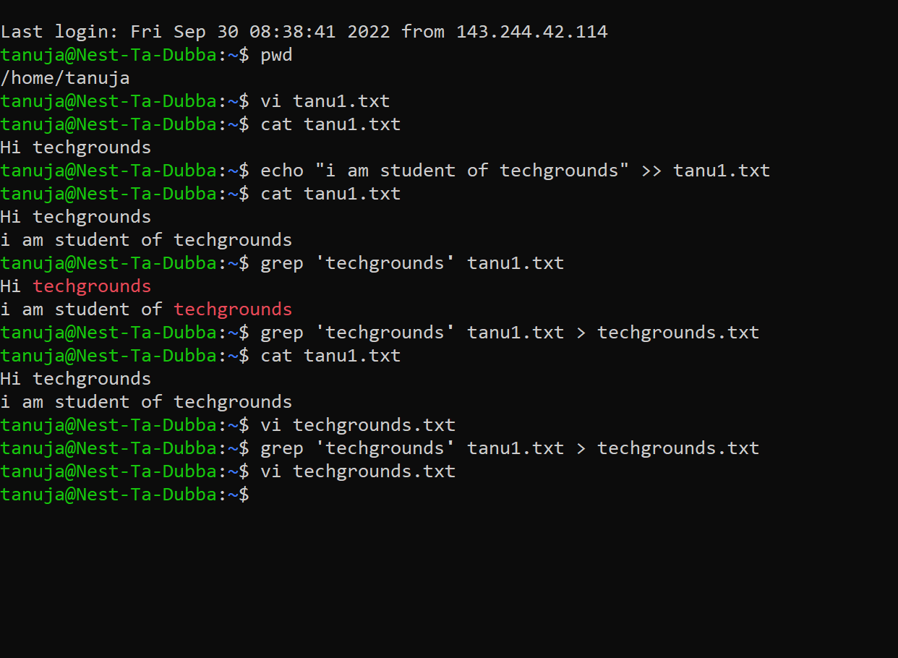

lnx3exp.md
# Working with text (CLI)
# Key terminology
- Input
- output
- Terminal
- Pipe command
- stdin 
- stdout
# Excercise
- Using the echo command echo "text" >> filename i wrote a  new sentence to the file.By using cat filename command i was able to see the contents of the file.Later i did some research to  find the command to filter specific word.
# Source
https://www.educative.io/answers/how-to-do-input-output-redirection-in-linux
https://www.cyberciti.biz/faq/linux-append-text-to-end-of-file/
https://www.cyberciti.biz/faq/howto-use-grep-command-in-linux-unix/

[]

