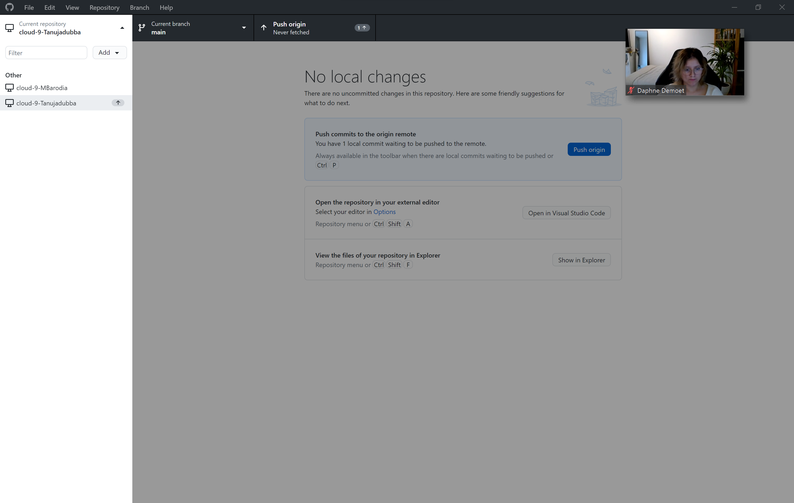
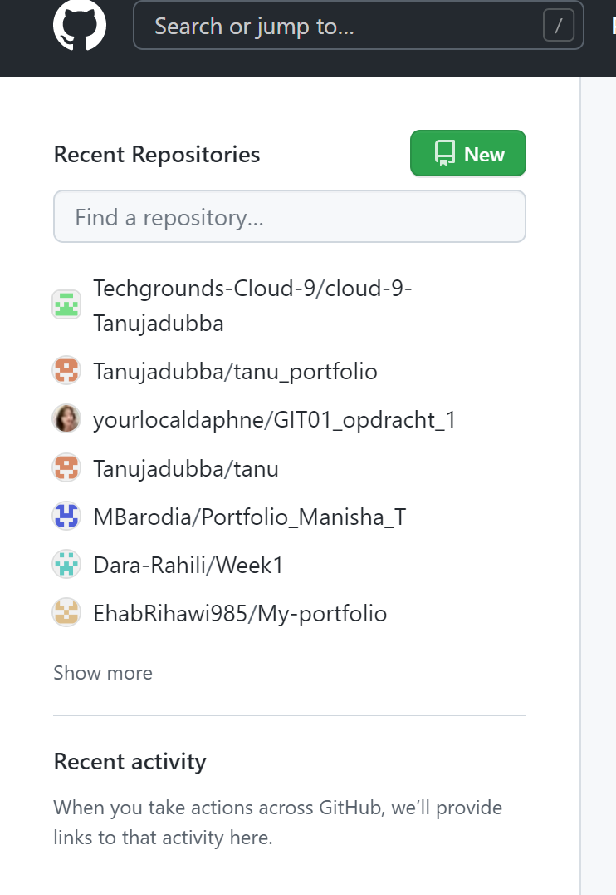

 # GIT GITHUB
[Git is a devops code management tool.Github lets pepole make mltiple changes at the same time.]

# Key terminology
REPOSITORY: Repository contains all your files and revision history.You can see the changes made by others.
REPO:Is a digital directory. You can access your project and it"s all version of files.
MAIN: If you create a new digital directory in your local system and in github yhe the default name of directory (repo) might be main.
MASTER:The default  branch name at github is master.
BRANCH:It will allow you to fix problems and try new ideas in a safely contained area of your own repoistory.
COMMIT:You can change a file individually.
PUSH:If you create new file/folder firstly you have to commit history from your repository upto Github by pushing.
MERGE:Merging is Gits way of pulling history back to its origin.
FORK:It's a copy of repository that you manage.
# Exercise
- I have created my own GIT account.
- Gave permisions to the teammates and learning coach.
- Able to  clone team member repository.
- Push my files to the repository.
- Shared with learning coach.

# Sources
https://en.wikipedia.org/wiki/GitHub
https://www.google.com/search?q=repo+meaning+in+github&rlz=1C1RXQR_enIN1018IN1018&sxsrf=ALiCzsYR2SO3N2biyCD1Ks83VIMxD8Jrbg%3A1664338650126&ei=2sozY7ysB5i2sAfy16WgCw&oq=repo+meaning+in+gi&gs_lcp=Cgdnd3Mtd2l6EAEYADIFCAAQgAQyBggAEB4QFjIGCAAQHhAWMgYIABAeEBYyBggAEB4QFjIFCAAQhgMyBQgAEIYDOgoIABBHENYEELADOgcIABCwAxBDOg0IABDkAhDWBBCwAxgBOhIILhDHARDRAxDIAxCwAxBDGAI6DAguEMgDELADEEMYAjoECAAQQzoECC4QQzoFCC4QgAQ6BwguENQCEEM6CggAEIAEEIcCEBQ6CQgAEEMQRhD5AToKCAAQHhAPEBYQCjoICAAQHhAPEBZKBAhBGABKBAhGGAFQjRRYj2JgqXhoAXABeACAAf0BiAGGCZIBBjEyLjEuMZgBAKABAcgBE8ABAdoBBggBEAEYCdoBBggCEAEYCA&sclient=gws-wiz
https://www.youtube.com/watch?v=vbQ2bYHxxEA
https://www.youtube.com/watch?v=GYZBxXmrfWU
# Overcome challenges
I was unable to understand how to push and clone.Took a while to figure it out.Had help from teammates to solve few issues.

# Results
[]
[]
