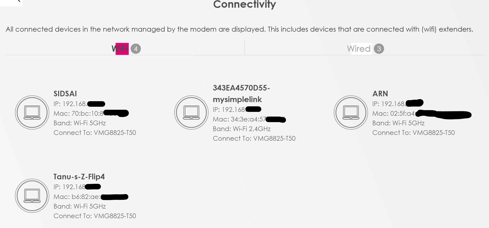
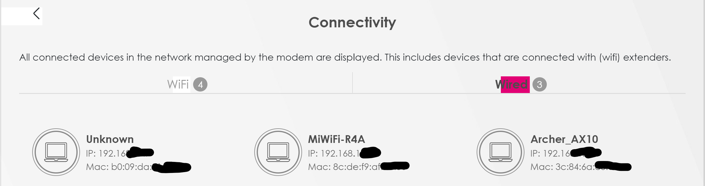

ipaddress.md
# Ip address
# Keywords
- Ip address
- Ipv4
- Ipv6
- public and private ip address
- Nat
- Static address
- Dynamics address

# Excercise
> Find out what your public IP address is of your laptop and mobile on WiFi.

- Are the addresses the same or not? Explain why.
 When i check my phone and laptop public ip address i osberverd both devices have diffrent ip address.Then i looked up for the reson i dind finf much information.Then in quora i found some informatio.There my be several possiblities
 > The WiFi network might have a load-balancing NAT and your two devices happened to land on different IPs.

 Change the private IP address of your mobile to that of your laptop. What happens then?

- Try to change your mobile's private IP address to an address outside your network. What happens then?

[]

[]

# Source
(https://kinsta.com/blog/ipv4-vs-ipv6/)
(https://www.geeksforgeeks.org/difference-between-private-and-public-ip-addresses/)
(https://www.techopedia.com/definition/9544/static-internet-protocol-address)
(https://www.techtarget.com/whatis/definition/dynamic-IP-address)
(https://www.quora.com/Why-is-my-phone-s-public-IP-address-my-laptops-public-IP-address-different-when-both-devices-are-connected-to-the-same-WiFi-connection)
