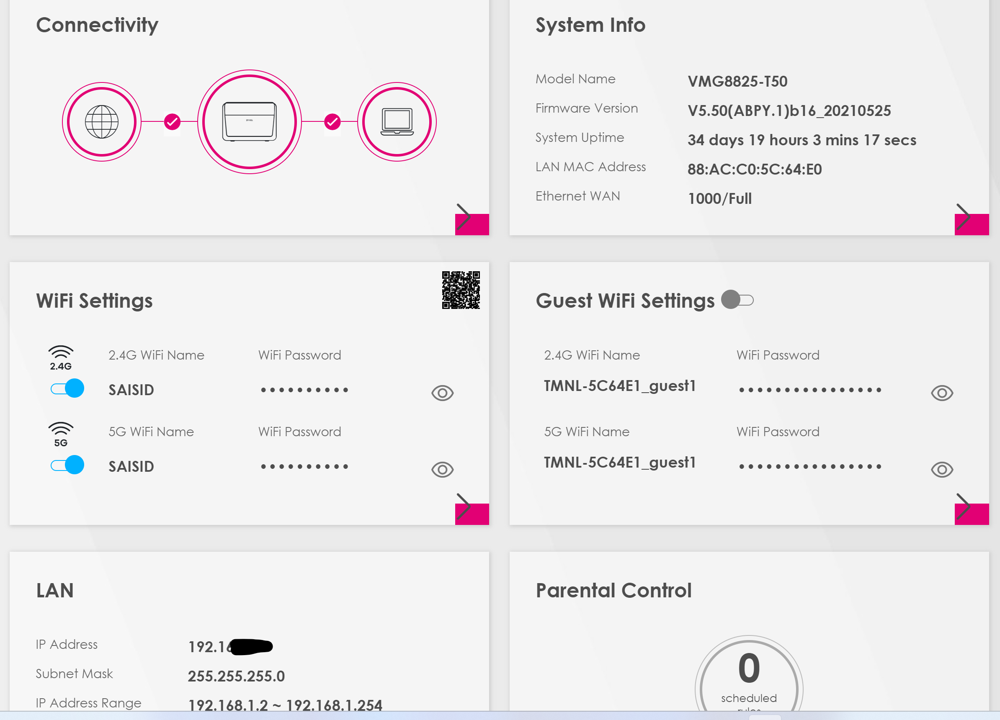

networkdevices.md
# NETWORK DEVICES
**contents**	
* Computer Network Device – Overview
* Purpose of Networking Devices
* What is Network Management
* Types of Network Devices
* Key Components of Networking Devices
* Importance of Intelligent Network Device Management
**Purpose of networking device**
 It is to enable smooth communication between different hardware connected to a network. Addition of a network device helps in hassle free sharing of network resources between different systems.
 # Types of networking devices
1.Repeater
2.Network Hub
3.Bridge
4.Switch/Network switch
5.Modem
6.Gateway
7.Access Point
**Repeater**
Repeater simply copies the signal bit by bit and re-generates at its original strength by operating at the physical layer.
**Network Hub**
It is a multiport repeater connects multiple wires from different branches.
* There are 3 types of Network hubs
1.Active hub
2.Passive hub
3.Intelligent hub
**Bridge**
A bridge is a device  that joins any two networks or host segments togeather.
**Switch**
A switch place more important role than a hub.Switch is a multiport devices that enhances network efficiency Gateway.
**Modem**
Modem are devices that transform digital signals into the form of analog signals that are of varios frequencies.
**Gateway**
A gateway is a passage that interlinks two networks togeather.
**Access point**
Acces point is a wireless appliance that operats on the OSI models second layer.
# Exercise
 Most routers have an overview of all connected devices, find this list. What other information does the router have about connected equipment?

[]

- Where is your DHCP server located on your network? What are the configurations of this?

[!alt test](../../00_includes/week2images/Dhcpconfi.png "Dhconfi.png")]

# SOURECE
(https://blog.netwrix.com/2019/01/08/network-devices-explained/)
(https://www.techjockey.com/blog/what-are-computer-network-devices#:~:text=The%20purpose%20of%20networking%20devices,network%20resources%20between%20different%20systems)

# Overcome challanges
No overcome challanges.

