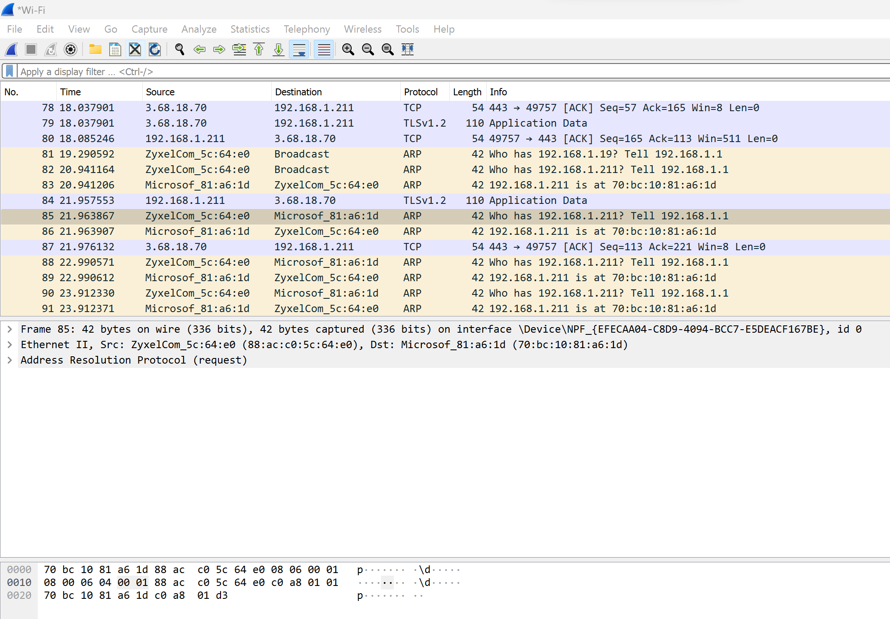
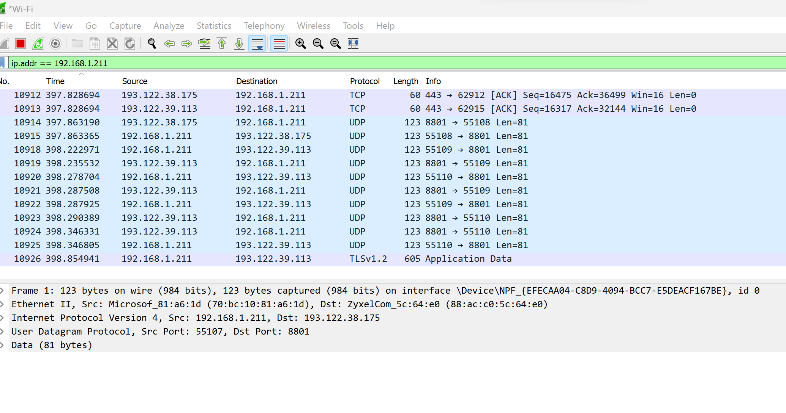

protocol.md
# PROTOCOLS
A  network protocol is an established set of rules that determine how data is transmitted between different devices in the same network.
# KEYTREMINOLGY
>> There are various types of protocols that support a major and compassionate role in communicating with different devices across the network. These are:
+ Transmission Control Protocol (TCP)
+ Internet Protocol (IP)
+ User Datagram Protocol (UDP)
+ Post office Protocol (POP)
+ Simple mail transport Protocol (SMTP)
+ File Transfer Protocol (FTP)
+ Hyper Text Transfer Protocol (HTTP)
+ Hyper Text Transfer Protocol Secure (HTTPS)
+ Telnet
+ Gopher

# EXCERCISE

-	Identify several other protocols and their associated OSI layer. Name at least one for each layer.

| Layernumber   | Layername    |        Protocol      |
| :---          |  :----:      |               ---:   |
| Layer 7       | Application  | SMPTP HTTP FTP       |
| layer 6       | Presentation | MPEG ASCH  SSL       |
| Layer 5       | Session      | NETBIOS SAP          |
| Layer 4       | Transport    | TCP UDP              |
| Layer 3       | Network      | PV5 PV6 ICMP IPSEC   |
| Layer 2       | Data link    | RAPA PP FRAMEREALY   |
| Layer 1       | Physical     | RS232 10013ASTX      |

-	Figure out who determines what protocols we use and what is needed to introduce your own protocol.
IANA determines what protocols we use.
The most common registration procedures are defined in RFC 8126. Examples of widely used registration procedures are:

> First Come First Served
> Expert Review
> Specification Required (this procedure includes Expert Review)
> RFC Required
> IETF Review
> IESG Approval

-	Look into wireshark and install this program. Try and capture a bit of your own network data. Search for a protocol you know and try to understand how it functions.

[]

When i cpature my own netwok data i found diffrent prortocols running simultamiously.I  did my search on *ARP*.

[]

> ARP is Address resolution protocol
When a new computer joins a local area network (LAN), it will receive a unique IP address to use for identification and communication. 
Packets of data arrive at a gateway, destined for a particular host machine.
There are different versions and use cases of ARP. 
+ Proxy Arp*
+ Gratuiotous Arp*
+ Reverse Arp*
+ Inverse Arp* 
# source
(https://www.fortinet.com/resources/cyberglossary/what-is-arp)
(https://www.iana.org/help/protocol-registration)
(https://www.w3schools.in/types-of-network-protocols-and-their-uses)
