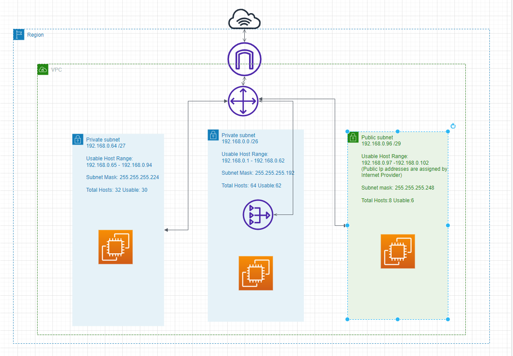

subnetting.md
# Subnetting
A subnet, or subnetwork, is a network inside a network. Subnets make networks more efficient. Through subnetting, network traffic can travel a shorter distance without passing through unnecessary routers to reach its destination.
# Natgatway
A NAT gateway is a Network Address Translation (NAT) service. You can use a NAT gateway so that instances in a private subnet can connect to services outside your VPC but external services cannot initiate a connection with those instances.
# Cidr Notation
In CIDR notation, IP addresses are written as a prefix, and a suffix is attached to indicate how many bits are in the entire address. 
# Exercise
-	1 private subnet dat alleen van binnen het LAN bereikbaar is. Dit subnet moet minimaal 15 hosts kunnen plaatsen.
-	1 private subnet dat internet toegang heeft via een NAT gateway. Dit subnet moet minimaal 30 hosts kunnen plaatsen (de 30 hosts is exclusief de NAT gateway).
-	1 public subnet met een internet gateway. Dit subnet moet minimaal 5 hosts kunnen plaatsen (de 5 hosts is exclusief de internet gateway).

# Overcomechallenges
It took lot of time to understand the concept.Once i have bit of idea about subnetting and natgate way i was strated doing my sample diagram.while doing that my team mates have different opnion on the calculations.I was confused ,i put a hold on my assignment for one day and finsished my other asssingments first.

# Source
(https://dnsmadeeasy.com/support/subnet)
(https://dnsmadeeasy.com/support/subnet)
(https://www.techopedia.com/definition/28328/subnetting)
(https://www.calculator.net/ip-subnet-calculator.html?cclass=c&csubnet=27&cip=192.168.0.0&ctype=ipv4&printit=0&x=79&y=21)
(https://docs.aws.amazon.com/vpc/latest/userguide/vpc-nat-gateway.html)
(https://whatismyipaddress.com/cidr)

# Result

[]

# Expalanation

According to the  exrcise i need 3 subnets. By using subnetmask cheat i got the idea of hostrange.
The first Ip address of any subnet is used for the identification of the network. The devices use it to identify the network. Whereas the last IP address of a subnet if used for broadcast , if a device in the network wants to broadcast any message to all devices then it uses the last IP. 

For the private subnet to host 15 ,Im using the CIDR as 27, then i will have total 32 hostranges and usabel are 30 , its subnet address is 192.168.0.64/27,with usable host range 192.168.0.65 to 192.168.0.94.Subnet mask is 255.255.255.224

For the private subnet to host 30, Im using CIDR as 26, then i will have total hosts are 64 and usabel are 62.Subnet address is 192.168.0.o/26,with usable host range 192.168.0.1 to 192.168.0.62.Sub net mask is 255.255.255.192

For the public subnet C, Im using CIDR as 29, the subnet will have 8 hosts and usable are 6.subnet address is 192.168.0.96,with usable host range 192.168.0.97 to 192.168.0.102.Subnet mask is 255.255.255.248
**Public ip addresses are assigned by internet provider**