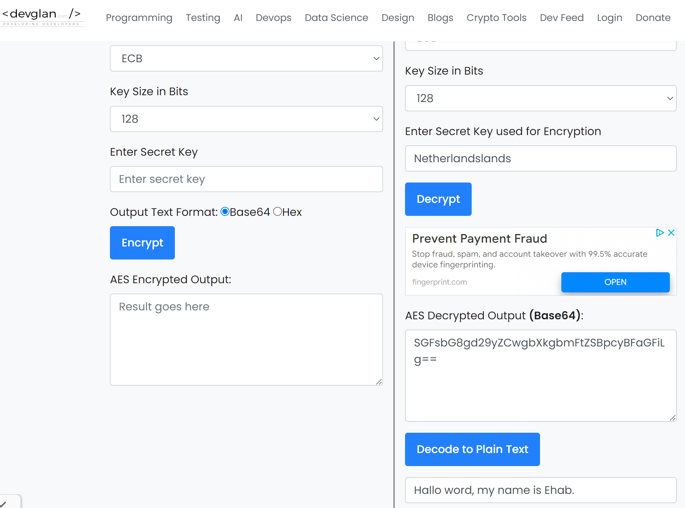
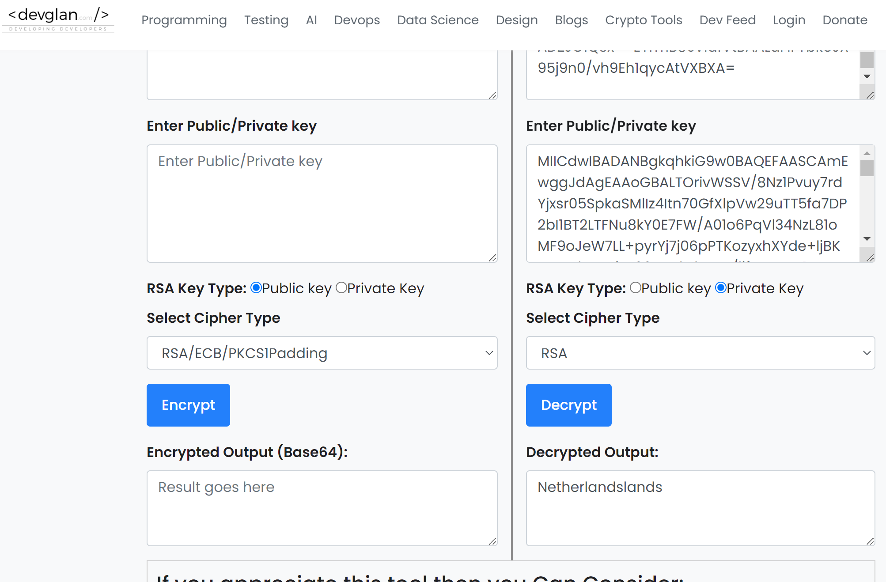

sec-04symmetric.md
# Introduction
- Symmetric encryption is a type of encryption where only one key (a secret key) is used to both encrypt and decrypt electronic data.
# Keywords
- Block algortihms
- Steam algorithms
- AES
- DES (Data Encryption Standard)
- IDEA (International Data Encryption Algorithm)
- Blowfish (Drop-in replacement for DES or IDEA)

There are two types of symmetric encryption:

- Block algorithms:Set lengths of bits are encrypted in blocks of electronic data with the use of a specific secret key. As the data is being encrypted, the system holds the data in its memory as it waits for complete blocks.
- Steam algorithms:Data is encrypted as it streams instead of being retained in the system’s memory.

- DES:Is a standardized cipher for securing electronic communication.Des is not used anymore as its considered too weak.
- AES:The most commonly used symmetric algorithm is the Advanced Encryption Standard

*some examples where symmetric cryptograhy is used:*
- Payment applications, such as card transactions where PII needs to be protected to prevent identity theft or fraudulent charges
- Validations to confirm that the sender of a message is who he claims to be
- Random number generation or hashing

# Exercise
Find two more historic ciphers besides the Caesar cipher?
- Caesar cipher:The Caesar cipher, also called a Caesar shift, gets its name from Julius Caesar, who occasionally used this encoding method in his own private messages. As one of the most basic encryption techniques, the Caesar cipher works by replacing each letter in the original plaintext message with a different letter based off a fixed shift of the alphabet.

*Two more historic ciphers*
- Albertis disk:In 1467, architect Leon Battista Alberti described a curious device. It was a disk made up of two concentric rings: the outer ring engraved with a standard alphabet, and the inner ring, engraved with the same alphabet but written out of order. By rotating the inner ring and matching letters across the disk, a message could be enciphered, one letter at a time, in a fiendishly complex way.
- The vigenere square:This 16th-century cipher uses a keyword to generate a series of different Caesar shifts within the same message. Though simple to use, this method of coding resisted all attempts to break it for over 300 years, earning it the nickname “le chiffre indéchiffrable”: the undecipherable cipher.

*Find two digital ciphers that are being used today*
- AES:Is the most secure encryption types, Advanced Encryption Standard (AES) is used by governments and security organizations as well as everyday businesses for classified communications. AES uses “symmetric” key encryption. Someone on the receiving end of the data will need a key to decode it.
- RSA:Rsa is the most secure encryption types, Advanced Encryption Standard (AES) is used by governments and security organizations as well as everyday businesses for classified communications. AES uses “symmetric” key encryption. Someone on the receiving end of the data will need a key to decode it.

[]

[]

# Source
(https://www.cryptomathic.com/news-events/blog/symmetric-key-encryption-why-where-and-how-its-used-in-banking)
(https://www.secplicity.org/2017/05/25/historical-cryptography-ciphers/)
(https://www.theguardian.com/childrens-books-site/2015/sep/10/top-10-codes-keys-and-ciphers)
(https://www.devglan.com/online-tools/aes-encryption-decryption)
(https://www.hp.com/us-en/shop/tech-takes/what-are-different-types-of-encryption)

