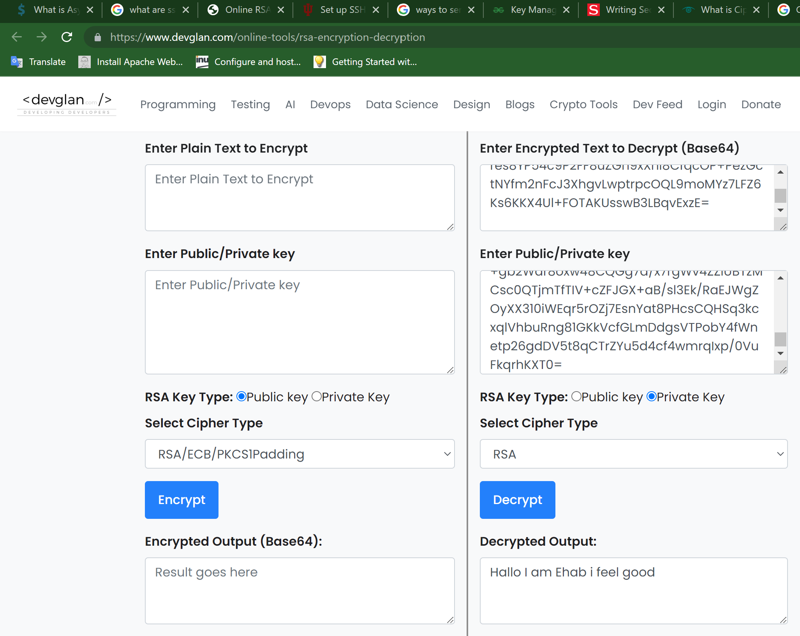

sec-05asymmetric.md
# Introdution
-Asymmetric encryption encrypts and decrypts the data using two separate yet mathematically connected cryptographic keys.These keys are known as a public and a private key.
- Togeather they are called public and private key pair.
- The algorithm is basically a combination of two functions – encryption function and decryption function.

# Expalanation:
- we are using Asymmetric Encryption without even realizing it,
- When you visit any HTTPS website/webpage, your browser establishes Asymmetrically encrypted connection with that website. Your browser automatically derives the public key of the SSL/TLS certificate installed on the website (that’s why it’s called ‘Public Key’). Do you want to see what it looks like? Click the green padlock you see in front of our URL, and go to certificate details.
- SSL/TLC certificates allow web browser to identify and establish encrypted network connection to web site using the SSL/TLC protocol.

# Overcome challenges

I was bit confused ,i was planning to do symmetric exercise and was learing symmetric encryption.Shika suggested to do the my Asymmetric exercise for better understanding.For some time i am mixing both assingments togeather.After a small discusion with my team members i was able to do.

# Exercise
- Genarate key pairs
  I have genrated both public and private key by using this website(https://www.devglan.com/online-tools/aes-encryption-decryption)
-I sent my public encryption key to Ehab via the slack channel.
-Ehab used it to encrypt the message by using the same website and he sent me back the encrypted message.
-We both used RSA encryption.

[]

# Source
(https://cheapsslsecurity.com/blog/what-is-asymmetric-encryption-understand-with-simple-examples/)
(https://www.digicert.com/how-tls-ssl-certificates-work)
(https://www.devglan.com/online-tools/aes-encryption-decryption)
( https://www.devglan.com/online-tools/rsa-encryption-decryption)

