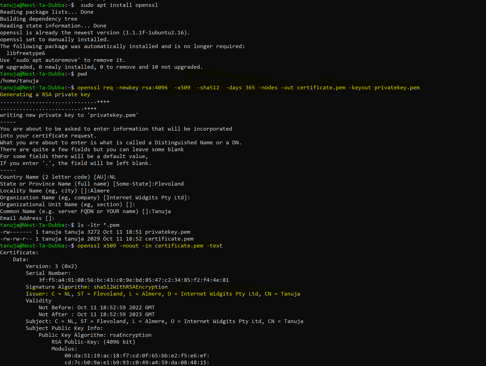
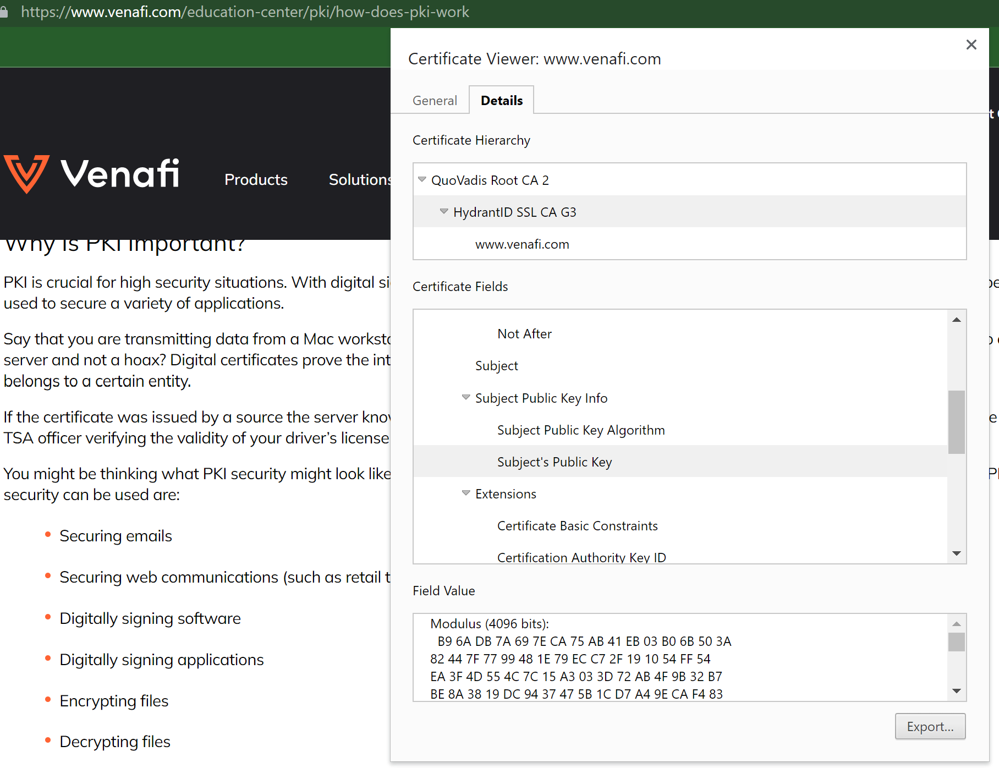
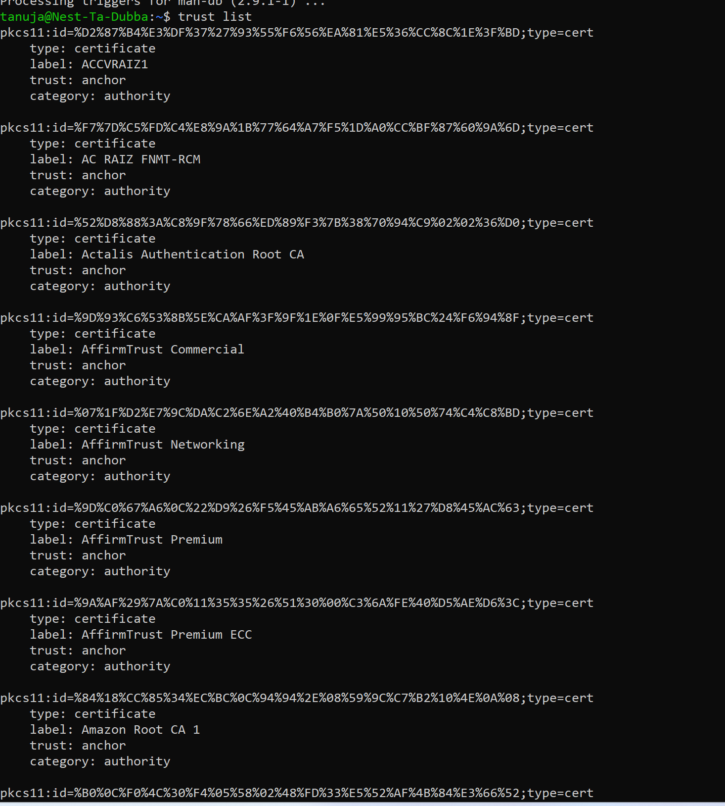

sec-6publickey.md
# Introduction
- PKI (or Public Key Infrastructure) is the framework of encryption and cybersecurity that protects communications between the server (your website) and the client (the users).

# Self signed certificates

- Another strategy is to issue self-signed SSL certificates. A self-signed certificate is one that is not signed by a CA at all – neither private nor public. In this case, the certificate is signed with its own private key, instead of requesting it from a public or a private CA.

- Purpose of this Certificate Type

 Although they can be risky, self-signed certificates do have their uses. Chiefly, they are available at no cost and can be requested easily by any developer. They are able to be implemented on your own timetable and are often used in internal testing environments or web servers that are otherwise locked down to external users.

# Source

(https://www.keyfactor.com/resources/what-is-pki/)

(https://www.youtube.com/watch?v=CqkPraRDuHY)

(https://wiki.debian.org/Self-Signed_Certificate)

(https://linuxconfig.org/how-to-generate-a-self-signed-ssl-certificate-on-linux)

(https://www.keyfactor.com/blog/self-signed-certificate-risks/)

# Exercise

- Create a self-signed certificate on your VM.

[ "sec06selsignedcert.png"]

- Analyze some certification paths of known websites (ex. techgrounds.nl / google.com / ing.nl).

[ "sec06certificationpath.png"]

- Find the list of trusted certificate roots on your system (bonus points if you also find it in your VM).

[ sec06trustlistvm.png"]

