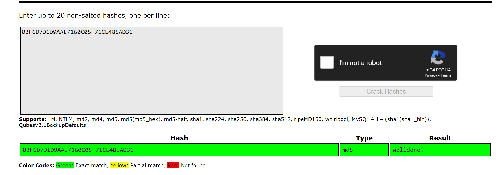
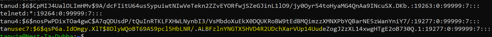

sec7passwords.md

# Introduction

- While most everyone has at some point heard the basics of password security (use a strong password, don’t use the same password on different sites, etc.), many of us still brush off that advice because it seems too complicated, or it feels like we just don’t have the time. We use the same password across different sites; we use passwords that are easy for others to figure out – and just hope for the best. But passwords are just as important as other tools we use to verify our identity – like driver’s licenses, social security cards, and passports – and they are just as important to keep secure. Below we’ve listed some key tips to simplifying your password security – and to understanding why it’s so important.

# Source
(https://www.section.io/engineering-education/understand-hashing-in-cryptography/)

(https://www.geeksforgeeks.org/understanding-rainbow-table-attack/)

(https://www.loginradius.com/blog/identity/what-is-salt/)

(https://www.techsafety.org/passwordincreasesecurity)

# Exercise

- Find out what hashing is and why it is preferred over symmetric encryption for storing passwords.
  - A hash value is the output of plaintext or ciphertext. Hashing is a cryptographic technique that transforms any form of data into a special text string. For any given input, there is a deterministic output. When you put a plaintext into a hashing algorithm in simpler terms, you get the same outcome. Suppose you change anything about the input or the plaintext to the hashing algorithm. The hashing output also becomes different.
  - Hashing differs significantly from encryption, however, in that it is a one-way process. There is no easy way to unscramble the data, interpret the output, or reverse-engineer the input. There's no key, no system of two keys, no publicly-accessible keys, no certificates that will grant you access to the original data.

 - Find out how a Rainbow Table can be used to crack hashed passwords.
   - The passwords in a computer system are not stored directly as plain texts but are hashed using encryption. A hash function is a 1-way function, which means that it can’t be decrypted. Whenever a user enters a password, it is converted into a hash value and is compared with the already stored hash value. If the values match, the user is authenticated. 
   - The rainbow table itself refers to a precomputed table that contains the password hash value for each plain text character used during the authentication process. If hackers gain access to the list of password hashes, they can crack all passwords very quickly with a rainbow table. 

- Below are two MD5 password hashes. One is a weak password, the other is a string of 16 randomly generated characters. Try to look up both hashes in a Rainbow Table.
03F6D7D1D9AAE7160C05F71CE485AD31
03D086C9B98F90D628F2D1BD84CFA6CA

[]

- Create a new user in Linux with the password 12345. Look up the hash in a Rainbow Table.

[]

-	Despite the bad password, and the fact that Linux uses common hashing algorithms, you won’t get a match in the Rainbow Table. This is because the password is salted. 
