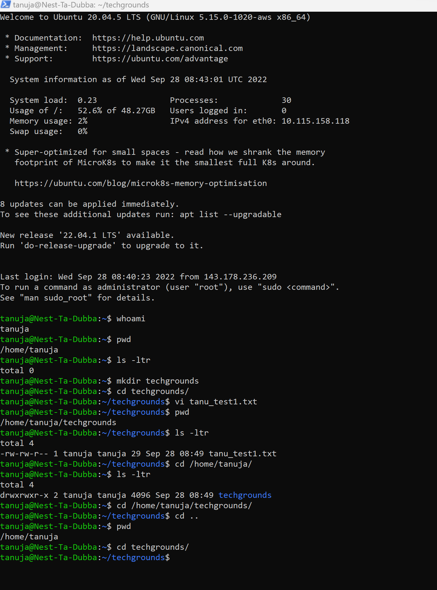

lnx4usersandgroups.md

# Users and groups

- Linux has users, similar to accounts on Windows and MacOS. Every user has their own home directory. Users can also be part of groups.
There is a special user called ‘root’. Root is allowed to do anything.
- Users within the same group can read, write, or execute files owned by the group.
- There are three types of user in linux: - root, regular and service.

# Source

(https://www.linode.com/docs/guides/linux-users-and-groups/)

(https://www.computernetworkingnotes.com/linux-tutorials/types-of-users-in-linux-explained-with-accounts.html)

(https://support.stackpath.com/hc/en-us/articles/360025308732-Add-Users-to-a-Virtual-Machine)

(https://www.geeksforgeeks.org/grep-command-in-unixlinux/)

(https://www.freecodecamp.org/news/linux-how-to-add-users-and-create-users-with-useradd/)

# Exercise:

- Create a new user in your VM. 
- The new user should be part of an admin group.
- The new user should have a password.
- The new user should be able to use ‘sudo’
- Locate the files that store users, passwords, and groups. See if you can find your newly created user’s data in there.

# Result

