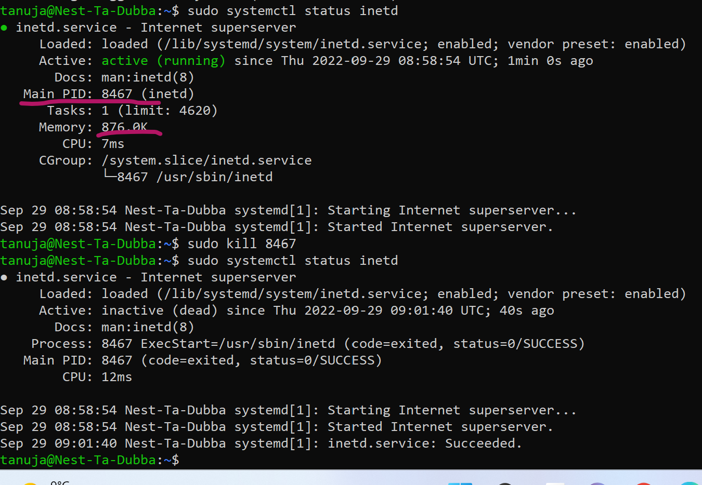

lnx6process.md

# Process

- Processes in Linux can be divided into three categories: Daemons, Services, and Programs.
A daemon runs in the background and is non-interactive. A Service responds to requests from programs. A service may be interactive.

**Telnet**

- Telnet is an old network protocol that is used to connect to remote systems over a TCP/IP network.

**Pid**

- A PID is an acronym for process identification number on a Linux or Unix-like operating system. A PID is automatically assigned to each process when it is created. A process is nothing but running instance of a program and each process has a unique PID on a Unix-like system.

# Source

(https://www.tecmint.com/linux-process-management/)

(https://www.geeksforgeeks.org/processes-in-linuxunix/)

(https://www.slashroot.in/telnet-server-linux)

(https://www.cyberciti.biz/faq/howto-display-process-pid-under-linux-unix/#:~:text=A%20PID%20is%20an%20acronym,on%20a%20Unix%2Dlike%20system.)

# Exercise

- Start the telnet daemon.
- Find out the PID of the telnet daemon.
- Find out how much memory telnetd is using.
- Stop or kill the telnetd process.

# Result

