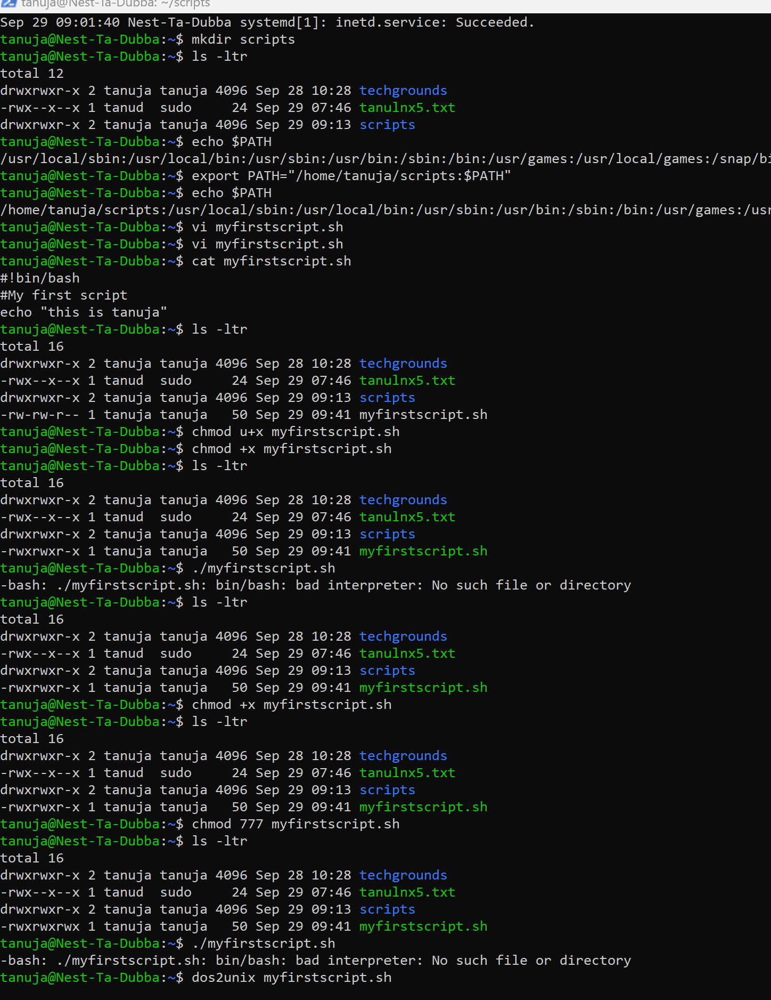
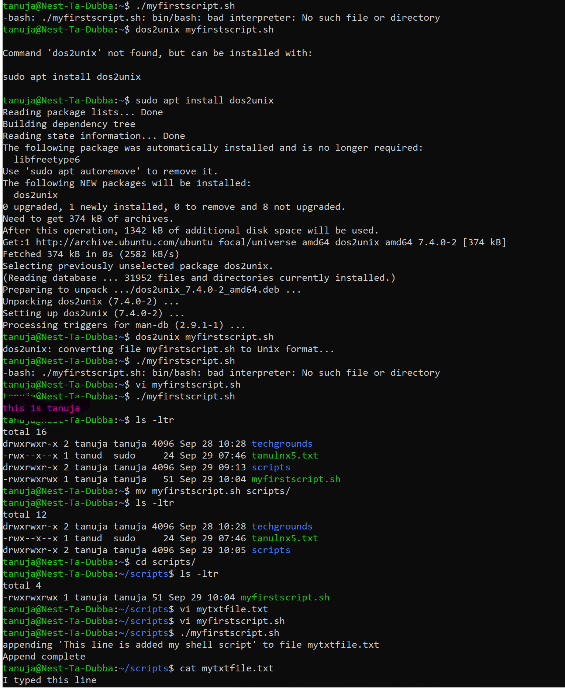
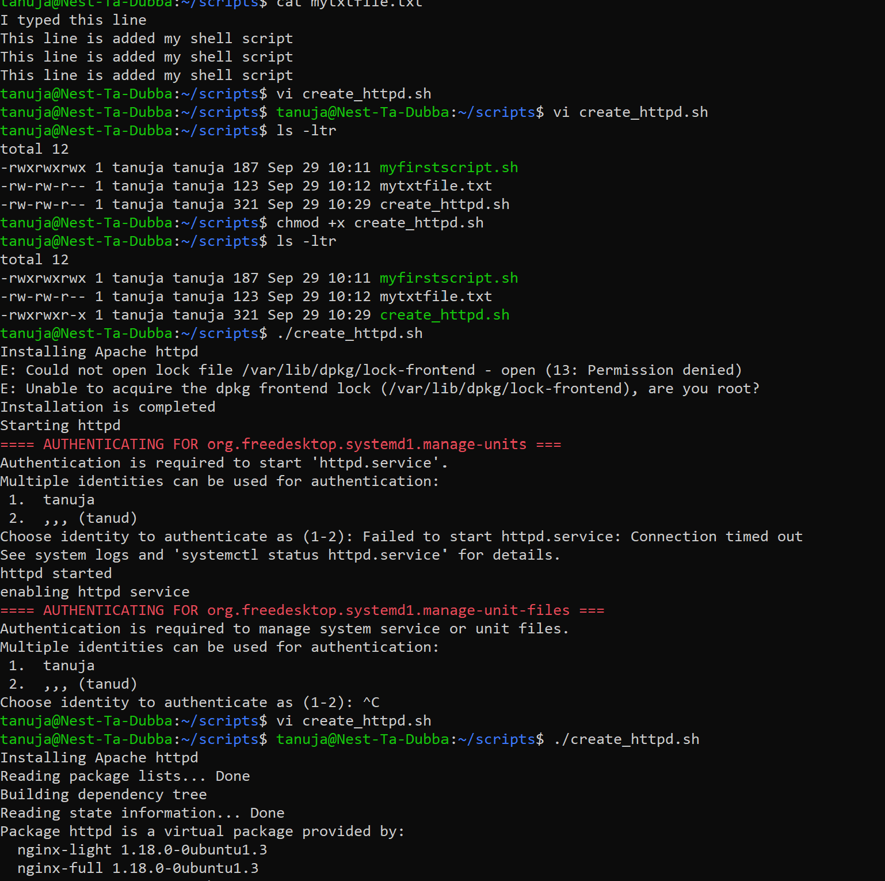
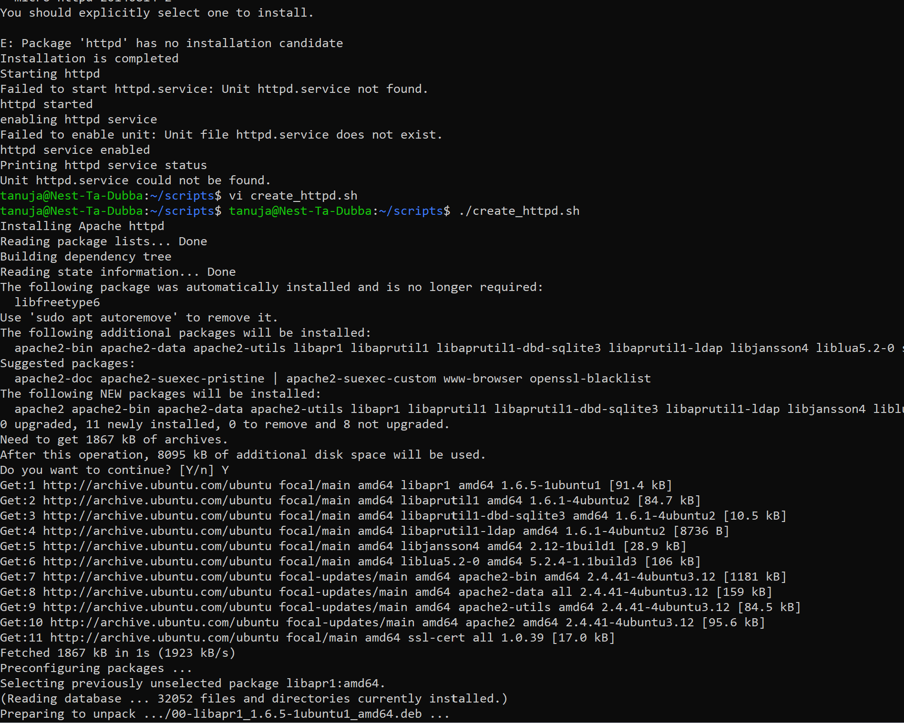
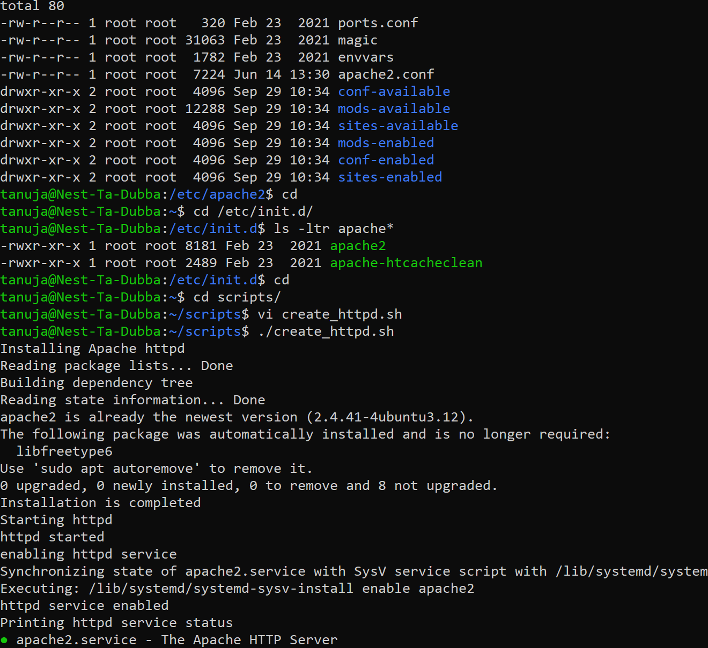
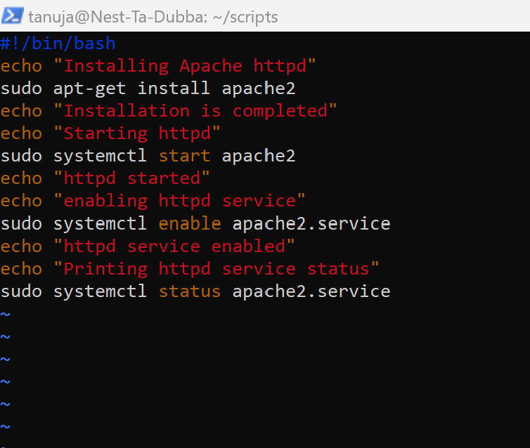
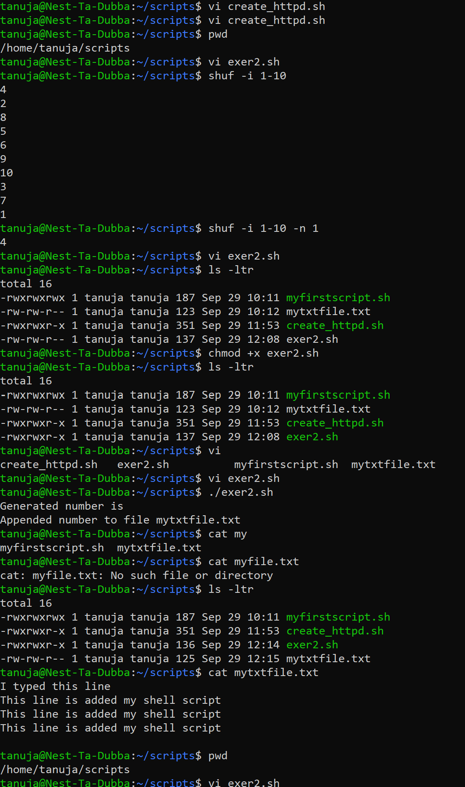
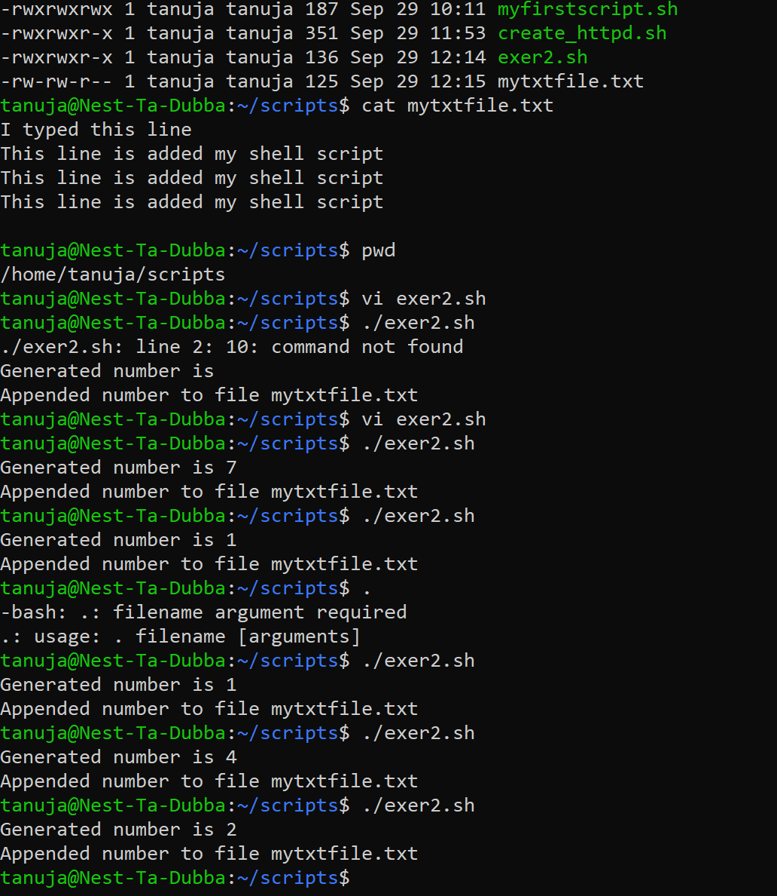
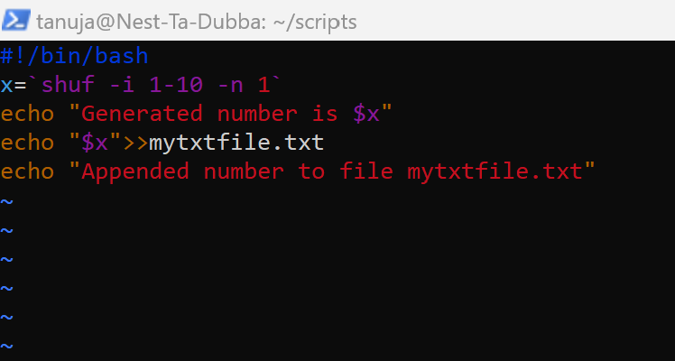
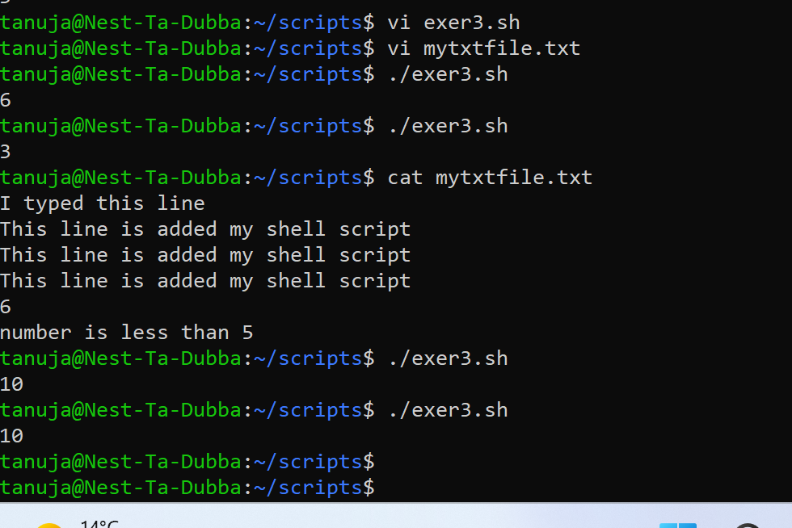

lnx7bashscripting.md

# Bashscripting

- The default command line interface in Linux is called a Bash shell.
- A bash script is a series of commands written in a file. These are read and executed by the bash program.

**Shell**

- Shell is a macro processor which allows for an interactive or non-interactive command execution.

**Scripting**

- Scripting allows for an automatic commands execution that would otherwise be executed interactively one-by-one.
Bash Shell 

# Source
(https://linuxconfig.org/bash-scripting-tutorial-for-beginners)

(https://linuxconfig.org/bash-scripting-tutorial)

(https://www.howtogeek.com/442332/how-to-work-with-variables-in-bash/)

(http://www.compciv.org/topics/bash/variables-and-substitution/)

# Exercise

- Create a directory called ‘scripts’. Place all the scripts you make in this directory.
- Add the scripts directory to the PATH variable.
- Create a script that appends a line of text to a text file whenever it is executed.
- Create a script that installs the httpd package, activates httpd, and enables httpd. Finally, your script should print the status of httpd in the terminal

# Result

# Exercise 2:

- Create a script that generates a random number between 1 and 10, stores it in a variable, and then appends the number to a text file.

