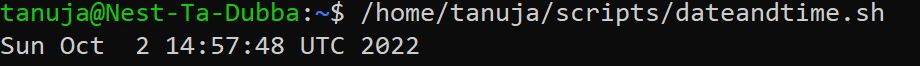
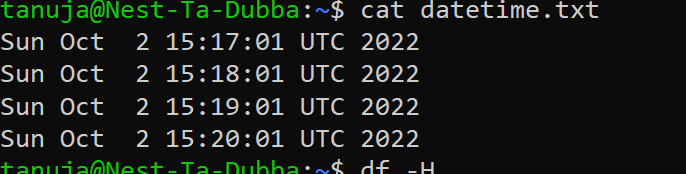
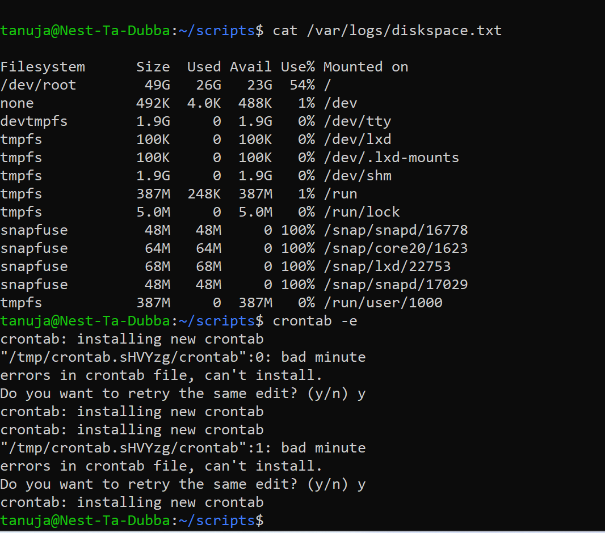
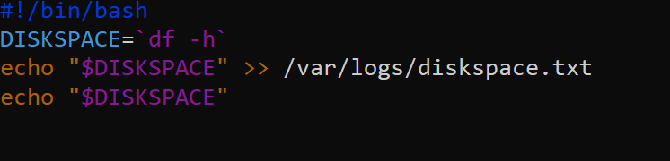

lnx8cronjobs.md

# Cronjobs
- A cron job is a Linux command used for scheduling tasks to be executed sometime in the future.
-  Cron is used to schedule commands at a specific time. These scheduled commands or tasks are known as "Cron Jobs"
- Cron is a daemon – a background process executing non-interactive jobs. In Windows, you might be familiar with background processes such as Services that work similarly to the cron daemon. 

# source
(https://ostechnix.com/a-beginners-guide-to-cron-jobs/)'

(https://www.hostinger.com/tutorials/cron-job)

(https://www.golinuxcloud.com/create-schedule-cron-job-shell-script-linux/)

(https://www.cyberciti.biz/faq/how-do-i-add-jobs-to-cron-under-linux-or-unix-oses/)

# Exercise

- Create a Bash script that writes the current date and time to a file in your home directory.
- Register the script in your crontab so that it runs every minute.
- Create a script that writes available disk space to a log file in ‘/var/logs’. Use a cron job so that it runs weekly.

# Result

