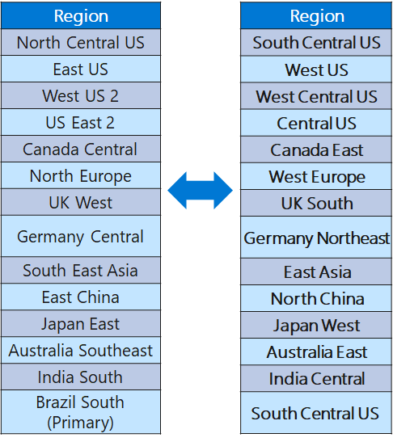

## Azure Global Infrastructure

# Introduction

- Azure global infrastructure is made up of two key components—physical infrastructure and connective network components. The physical component is comprised of 200+ physical datacenters, arranged into regions, and linked by one of the largest interconnected networks on the planet.

- With the connectivity of the global Azure network, each of the Azure datacenters provides high availability, low latency, scalability, and the latest advancements in cloud infrastructure—all running on the Azure platform.

- Together, these components keep data entirely within the trusted Microsoft network and IP traffic never enters the public internet.

# Exercise

**Wat is een Azure Region?**

- An Azure region is a set of datacenters deployed within an interval-defined perimeter and connected through a dedicated regional low-latency network. Azure gives customers the flexibility to deploy applications where they need with discrete pricing and service availability.

   - There are two region categories:
     - Recommended 
     - Alternate (other)
- Recommended: The recommended regions where you will find the most service and Availability Zones.
- Alternate: Alternate regions which are like filler regions. 

- Azure services are grouped into three categories or types:  

   - Foundational - Available in all Recommended and Alternate regions or within 90 days of a new foundational service becoming generally available.
   - Mainstream - Available in all recommended regions within 90 days of the region general availability; demand-driven in alternate regions .

   - Specialized - Targeted service offerings that are usually industry-focused or backed by customized hardware. Demand-driven availability across regions

**Wat is een Azure Availability Zone?**

- Azure Availability Zones are unique physical locations within an Azure region that offer high availability to protect your applications and data from datacenter failures. Each zone is made up of datacenters that are equipped with independent power, cooling, and networking.

- The physical separation of availability zones within a region is mapped out to protect data and running applications from facility-level issues. These zone-redundant services replicate your apps and data across Azure Availability Zones to protect from single points of failure.

**Wat is een Azure Region Pair?**

- An Azure Region Pair is a relationship between 2 Azure Regions within the same geographic region for disaster recovery purposes. If one of the regions were to experience a disaster or failure, then the services in that region will automatically failover to that regions secondary region in the pair.

- In the event of a massive Azure outage, each Azure Region Pair has a single region that is prioritized over the other for recovery. Systems deployed across multiple Azure Regions within a pair are guaranteed to have an Azure Region that will be recovered with high priority.

- Each Azure Region within a pair is physically / geographically located at least 300 miles apart where possible.

**Waarom zou je een regio boven een andere verkiezen?**

- To ensures minimal downtime in the event of bugs or logical failures caused by an update. By using Azure Region Pairs for replication and redundancy will ensure your applications and services are not adversely affected by a rare bad update event.

# Source

(https://cswsolutions.com/blog/posts/2021/september/azure-regions-what-they-are-why-they-matter/#:~:text=An%20Azure%20region%20is%20a,discrete%20pricing%20and%20service%20availability.)

(https://build5nines.com/azure-region-pairs-explained/)

(https://learn.microsoft.com/en-us/azure/availability-zones/cross-region-replication-azure)

