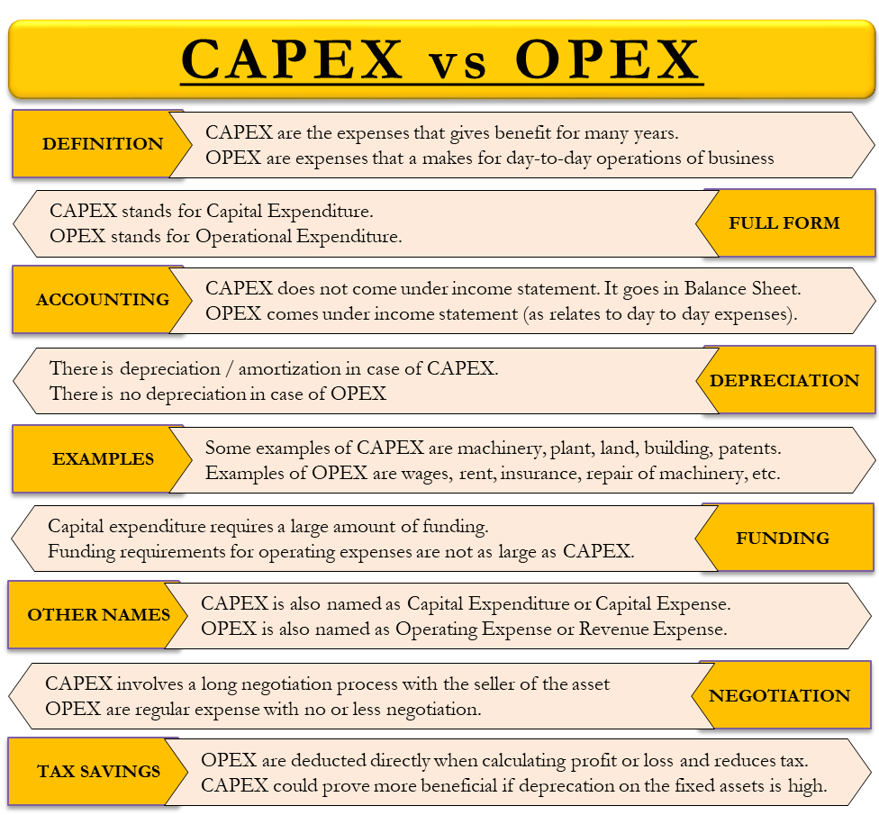
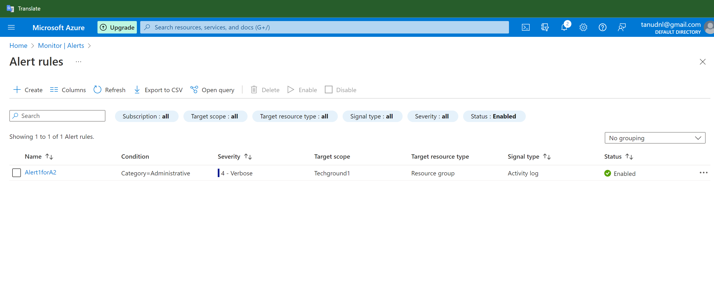

# Cost Management + Billing

# Introduction:

- Cost Management + Billing helps you understand your Azure invoice (bill), manage your billing account and subscriptions, monitor and control Azure spending and optimize resource use.

# Cost analysis
- Cost analysis should be your first stop in the Azure portal when it comes to understanding what you're spending and where you're spending. Cost analysis helps you:

- Visualize and analyze your organizational costs
- Share cost views with others using custom alerts
- View aggregated costs by organization to understand where costs occur over time and identify spending trends
- View accumulated costs over time to estimate monthly, quarterly, or even yearly cost trends against a budget
- Create budgets to provide adherence to financial constraints
- Use budgets to view daily or monthly costs and help isolate spending irregularities

# Methodology
- Cost management is an organizational problem and should be an ongoing practice that begins before you spend money on cloud resources. To successfully implement cost management and optimize costs, your organization must:

  - Be prepared with the proper tools for success
  - Be accountable for costs
  - Take appropriate action to optimize spending

  - Three key groups, outlined below, must be aligned in your organization to make sure that you successfully manage costs.

- Finance - People responsible for approving budget requests across the organization based on cloud spending forecasts. They pay the corresponding bill and assign costs to various teams to drive accountability.
- Managers - Business decision makers in an organization that need to understand cloud spending to find the best spending results.
- App teams - Engineers managing cloud resources on a day-to-day basis, developing services to meet the organization's needs. These teams need the flexibility to deliver the most value in their defined budgets.

# Planning
- Comprehensive, up-front planning allows you to tailor cloud usage to your specific business requirements. Ask yourself:

*What business problem am I solving?*
*What usage patterns do I expect from my resources?*
- Your answers will help you select the offerings that are right for you. They determine the infrastructure to use and how it's used to maximize your Azure efficiency.

# Visibility
- When structured well, Cost Management helps you to inform people about the Azure costs they're responsible for or for the money they spend. Azure has services designed to give you insight into where your money is spent. Take advantage of these tools. They can help you find resources that are underused, remove waste, and maximize cost-saving opportunities.

# Accountability
- Attribute costs in your organization to make sure that people responsible are accountable for their team's spending. To fully understand your organization's Azure spending, you should organize your resources to maximize insight into cost attribution. Good organization helps to manage and reduce costs and hold people accountable for efficient spending in your organization.

# Optimization
- Act to reduce your spending. Make the most of it based on the findings gathered through planning and increasing cost visibility. You might consider purchase and licensing optimizations along with infrastructure deployment changes that are discussed in detail later in this document.

# Iteration
- Everyone in your organization must engage in the cost management lifecycle. They need to stay involved on an ongoing basis to optimize costs. Be rigorous about this iterative process and make it a key tenet of responsible cloud governance in your organization.

# Free subscription

- When you start using Azure with a free account, you get $200 credit to spend in the first 30 days after you sign up. In addition, you get free monthly amounts of two groups of services: popular services, which are free for 12 months, and more than 40 other services that are free always.

# Capital Expenditures (CapEx)
- Capital expenditures (CapEx) are purchases of significant goods or services that will be used to improve a company’s performance in the future. They include the cost of fixed assets and the acquisition of intangible assets such as patents and other forms of technology

  - CapEx represents the company’s spending on physical assets. The following are common examples of capital expenditures:

   - Manufacturing plants, equipment, and machinery
   - Building improvements
   - Computers
   - Vehicles and trucks

# Operating Expenses (OpEx)
- Operating expenses are the costs that a company incurs for running its day-to-day operations. These expenses must be ordinary and customary costs for the industry in which the company operates   

  - The following are common examples of operating expenses:

  - Rent and utilities
  - Wages and salaries
  - Accounting and legal fees
  - Overhead costs such as selling, general, and administrative expenses (SG&A)
  - Property taxes
  - Business travel
  - Interest paid on debt

# How does the TCO works in Azure?

- The TCO Calculator lets you create a customised business case to justify migration to Azure. You have the option to modify any assumptions so the model accurately reflects your business. The result is a detailed report which shows how much money you can save by moving to Azure.

# Source

(https://learn.microsoft.com/en-us/azure/cost-management-billing/)

(https://learn.microsoft.com/en-us/azure/cost-management-billing/costs/reporting-get-started)

(https://azure.microsoft.com/en-us/pricing/tco/calculator/)

(https://www.youtube.com/playlist?list=PLLasX02E8BPBJW49E5_sHgbgvztb4oz6D)

(https://azure.microsoft.com/en-us/pricing/free-services/)

(https://www.investopedia.com/ask/answers/112814/whats-difference-between-capital-expenditures-capex-and-operational-expenditures-opex.asp#:~:text=Key%20Differences,to%20keep%20a%20company%20running.)

(https://learn.microsoft.com/en-us/azure/azure-monitor/alerts/alerts-overview)

# Exercise:

- Create an alert with which you can monitor your own Cloud Pass.

