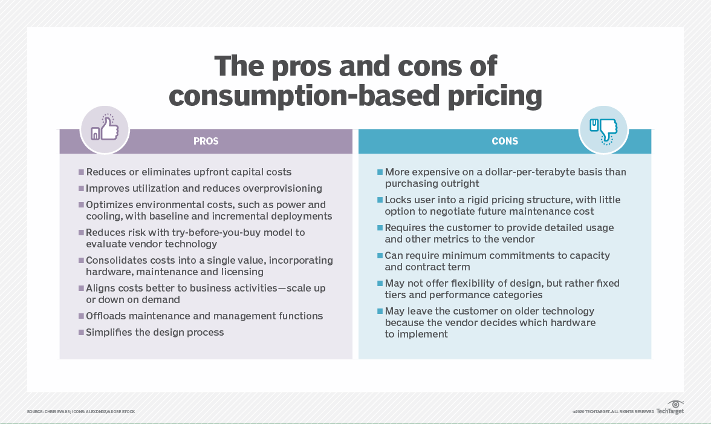

# Advantages of cloud

- There are significant savings in resource, maintenance, and real estate costs, in addition to the ability to optimize workloads so that they cost less to run.

# Key words

- Opex
- Capex
- Sla agreement

# Opex
*Operational Expenditure (OpEx)*
- No upfront cost but you pay for the service/product as you use it
- OpEx is particularly appealing if the demand fluctuates or is unknown
OpEX computing costs:
- Leasing software and customized features –  responsibility to de-provision the resources when they aren’t in use so that you can minimize costs.
- Scaling charges based on usage/demand instead of fixed hardware or capacity – plan for backup traffic and disaster recovery traffic to determine the bandwidth needed.
- Billing at the user or organization level – when using a dedicated cloud service, you could pay based on server hardware and usage.

# Capex

- Capital Expenditure (CapEx)
- Upfront cost on physical infrastructure
- You need to plan your expenses at the start of a project or budget period.
*CapEx computing costs:*
 - Server costs – server clustering, redundant power supplies, and uninterruptible power supplies.
 - Storage costs – centralized storage and fault-tolerant storage for critical applications.
 - Network costs – cabling, switches, access points, routers, wide area networks, and Internet connections.
 - Backup and archive costs – backup maintenance and consumables like tapes.
 - Organization continuity and disaster recovery costs – recover from a disaster and continue operating using backup generators.
- Datacenter infrastructure costs – costs for construction and building equipment.
- Technical personnel – technical expertise and workforce to install, deploy, and manage the systems in the data center and at the DR site.

# Sla agreement
The Azure Service Level Agreement (SLA) describes Microsoft’s commitments for uptime and connectivity for individual Azure Services.

Each Azure service has its own SLA with associated terms, limitations, and service credits. Some (free) services don’t have an SLA, for example, Azure DevTest Labs

**Six advantages of cloud computting:**

**High availability:** With zone-redundant architecture, the Azure platform automatically replicates the resource and data across zones. Microsoft manages the delivery of high availability, since Azure automatically replicates and distributes instances within the region.

**Scalability:** Scalability is the ability of a system to handle increased load. Services covered by Azure Autoscale can scale automatically to match demand to accommodate workload. These services scale out to ensure capacity during workload peaks and return to normal automatically when the peak drops.
   
   - Two main ways an application can scale include *vertical* scaling and *horizontal* scaling.
   
   - Vertical scaling (scaling up) increases the capacity of a resource

   -  Horizontal scaling (scaling out) adds new instances of a resource, such as VMs or database replicas.

   - Horizontal scaling has significant advantages over vertical scaling, such as:

      - True cloud scale: Applications are designed to run on hundreds or even thousands of nodes, reaching scales that aren't possible on a single node.
      - Horizontal scale is elastic: You can add more instances if load increases, or remove instances during quieter periods.
      - Scaling out can be triggered automatically, either on a schedule or in response to changes in load.
      - Scaling out may be cheaper than scaling up. Running several small VMs can cost less than a single large VM.
      - Horizontal scaling can also improve resiliency, by adding redundancy. If an instance goes down, the application keeps running 

**Elastisity:**Generally refers to increasing or decreasing cloud resources. An elastic system automatically adapts to match resources with demand as closely as possible, in real time.

**Agility:** Cloud agility is the ability to quickly develop, test, and launch applications in a cloud-based environment.

- Cloud agility helps create a competitive advantage as sweeping changes in technology pose lesser threats in an agile environment. Cloud agility gives customers and users expanded choice and quick access to computing resources.

**Geo Distribution:** With the geo-distributed pattern, your app spans regions. You can default to the public cloud, but some of your users may require that their data remain in their region. You can direct users to the most suitable cloud based on their requirements.

**Disaster recovery:** Disaster recovery is the process of restoring application functionality in the wake of a catastrophic loss.

  - Disaster reovery plan:

      Consider the following suggestions when creating and testing your disaster recovery plan:

- Include the process for contacting support and for escalating issues. This information will help to avoid prolonged downtime as you work out the recovery process for the first time.
- Evaluate the business impact of application failures.
Choose a cross-region recovery architecture for mission-critical applications.
- Identify a specific owner of the disaster recovery plan, including automation and testing.
- Document the process, especially any manual steps.
- Automate the process as much as possible.
- Establish a backup strategy for all reference and transactional data, and test backup restoration regularly.
- Set up alerts for the stack of the Azure services consumed by your application.
- Train operations staff to execute the plan.
- Perform regular disaster simulations to validate and improve the plan.

# The consumption based model:

- The common pricing options for Azure services are: Consumption-based price.
- You are charged for only what you use. This model is also known as the Pay-As-You-Go rate. Fixed price - You provision resources and are charged for those instances whether or not they are used

# Source

(https://www.alertlogic.com/blog/what-are-the-benefits-of-microsoft-azure-cloud-services/)

(https://intercept.cloud/en/news/demystifying-the-azure-sla/#:~:text=The%20Azure%20Service%20Level%20Agreement,for%20example%2C%20Azure%20DevTest%20Labs.)

(https://learn.microsoft.com/en-us/azure/architecture/framework/scalability/design-scale)

(https://reviewnprep.com/blog/scalability-vs-elasticity-in-cloud-computing/)

(https://www.hpe.com/in/en/what-is/cloud-agility.html)

(https://learn.microsoft.com/en-us/azure/architecture/hybrid/deployments/solution-deployment-guide-geo-distributed)

(https://learn.microsoft.com/en-us/azure/architecture/framework/resiliency/backup-and-recovery)

(https://www.youtube.com/watch?v=3fNr3QHdT0A)

(https://www.techtarget.com/searchcloudcomputing/definition/consumption-based-pricing-model)

