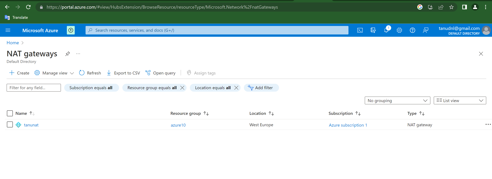
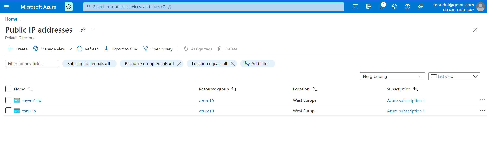
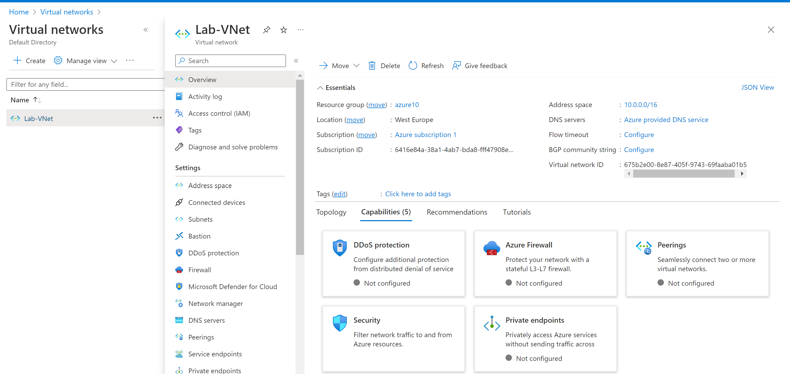
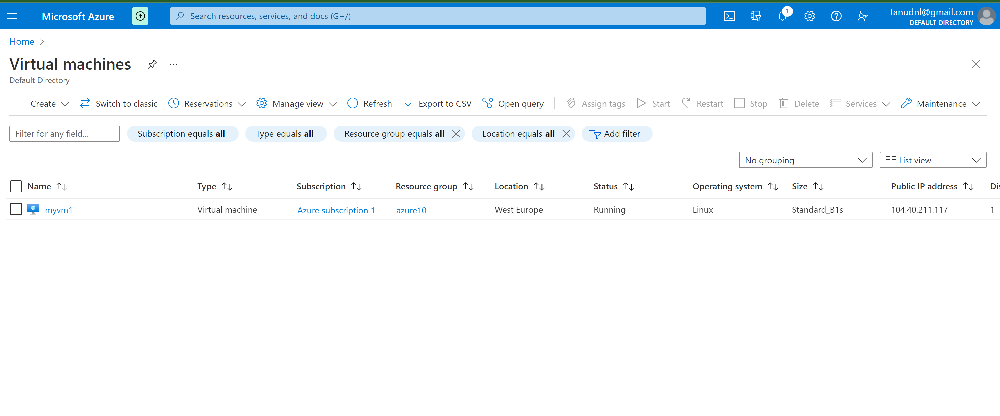
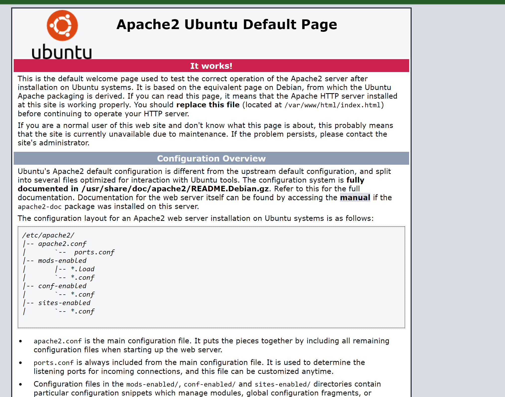

# Virtual Network(VNet)

- An Azure Virtual Network (VNet) is a representation of your own network in the cloud. It is a logical isolation of the Azure cloud dedicated to your subscription.

#  Some of the Advantages of Using Azure Virtual Network:

- It provides an isolated environment for your applications
- A subnet in a very VNet can access the general public internet by default
- We can easily direct traffic from resources
- It is a highly secure network
- It has high network connectivity
- It builds sophisticated network topologies in a very simple manner

- Azure networking components provide a large range of functionalities that may help companies build efficient cloud applications that meet their requirements.

   **Subnets**
    - Subnets let users segment the virtual network into one or more sub-networks.
   - These sub-networks may be separated logically, and every subnet consists of a server.

*We can further divide a subnet into two types:*

- Private – Instances can access the web with NAT (Network Address Translation) gateway that’s present within the public subnet.
- Public – Instances can directly access the net.

  **Routing**
   - It delivers the information by choosing an appropriate path from source to destination.
   - For each subnet, the virtual network automatically routes traffic and creates a routing table.

 **Network Security Groups**
  - It is a firewall that protects the virtual machine by limiting network traffic.
  - It restricts inbound and outbound network traffic depending upon the destination IP addresses, port, and protocol.

# Exercise:

- Create a Virtual Network with the following requirements:
    - Region: Western Europe
    -  Name: Lab-VNet
    - IP range: 10.0.0.0/16
    - Requirements for Subnet 1:
    - Name: Subnet-1
    - IPRange: 10.0.0.0/24
    - This subnet must not have a route to the Internet
    -  Requirements for Subnet 2:
    -  Name: Subnet-2
    - IPRange: 10.0.1.0/24

# Exercise 2:
  - Create a VM with the following requirements:
  - An apache server must be installed with the following custom data:
    *#!/bin/bash
    sudo su
    apt update
    apt install apache2 -y
    ufw allow 'Apache'
    systemctl enable apache2
    systemctl restart apache2*
 - No SSH access is required, but HTTP
 -  Subnet: Subnet-2
 - Public IP: Enabled
 - Check if your website is reachable

 

 

# Source

(https://learn.microsoft.com/en-us/azure/virtual-network/)

(https://learn.microsoft.com/en-us/azure/virtual-network/virtual-networks-overview)

(https://www.youtube.com/watch?v=Wb2rAYQ3Qbc)

(https://learn.microsoft.com/en-us/azure/virtual-network/manage-route-table)

(https://learn.microsoft.com/en-us/azure/virtual-network/ip-services/create-public-ip-portal?tabs=option-1-create-public-ip-standard)