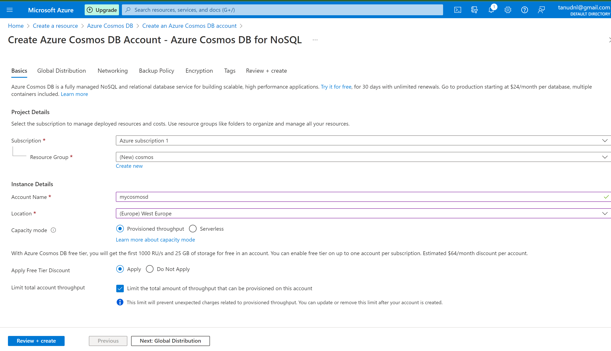
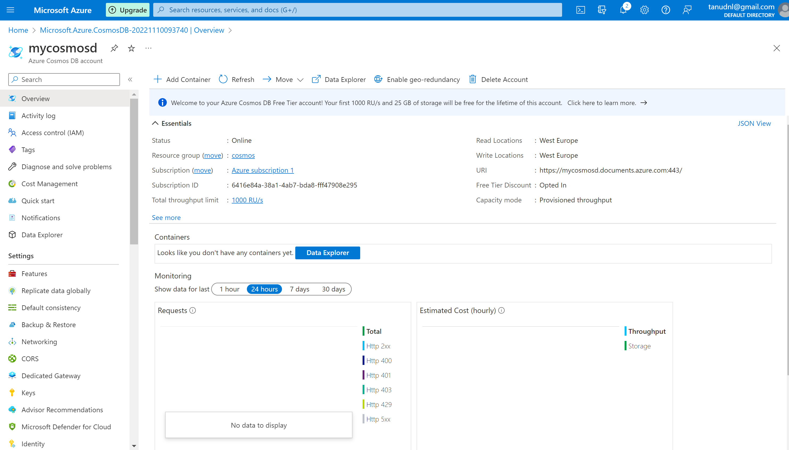
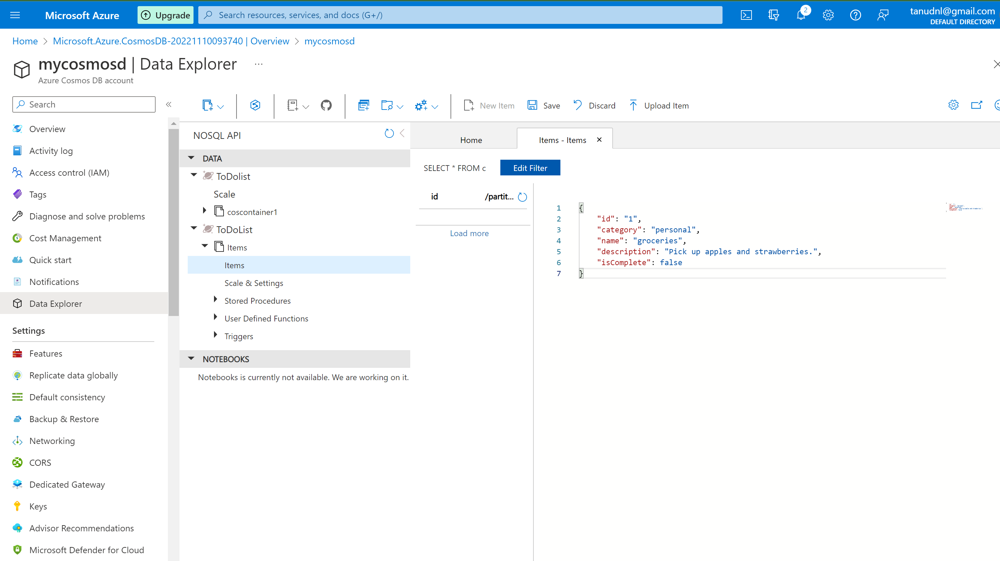
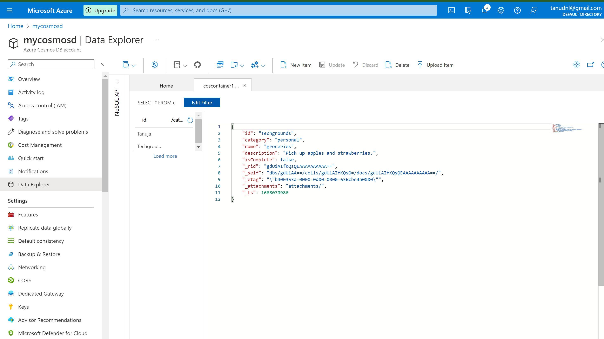
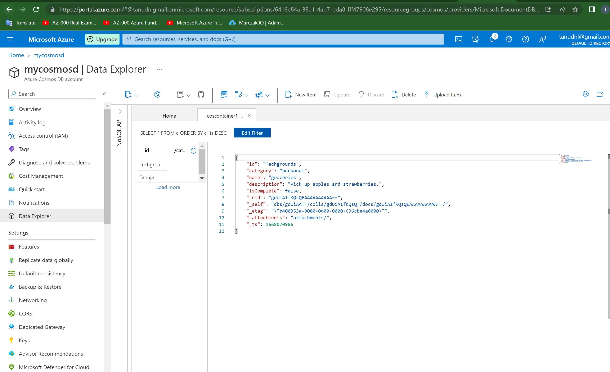
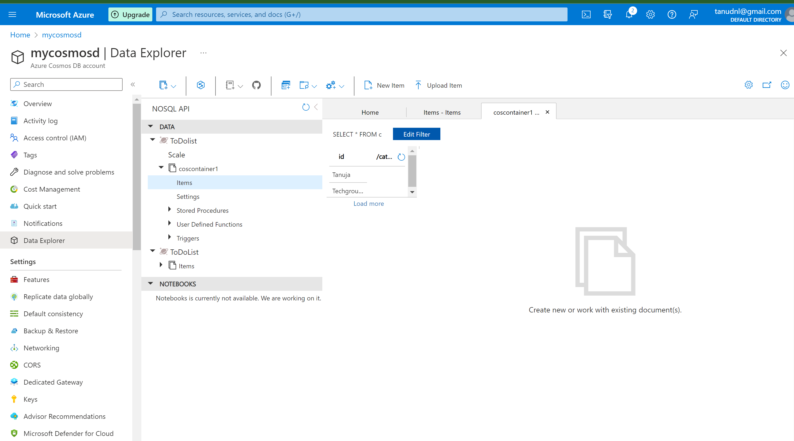

# Azure Cosmos DB

- Azure Cosmos DB ia a fully managed database service with turnkey global distribution and transparent multimaster replication.
- You can run globally distributed low latency operational and analytics workloads and AI on transactional data within your database.

**What is a document**

- In a computing javascript object Notation(JSON) is an open standard file format that uses human readable text to transmit data objects consisting of attribute value pairs and array data types.

**Key Features**

- Trunkey Global Distributio:Trasperant multi region distribution.
- Regional presence: Available in 54+ regions
- Always on:99.999% availability for reads and writes
- Elastic scale:From thousands to hundereds of millions of requests/sec
- Low latency guarantee:Under 10ms read/writ for 99 percentile
- Consistency options:Choose the right balance between performance and consistent replication
- No schema or index managment: Designed as schem agnostic.

# Exercise:

- Creating Cosmos DB:

# Source

(https://learn.microsoft.com/en-us/azure/cosmos-db/introduction)

(https://learn.microsoft.com/en-us/azure/cosmos-db/)

(https://learn.microsoft.com/en-us/azure/cosmos-db/relational-nosql)