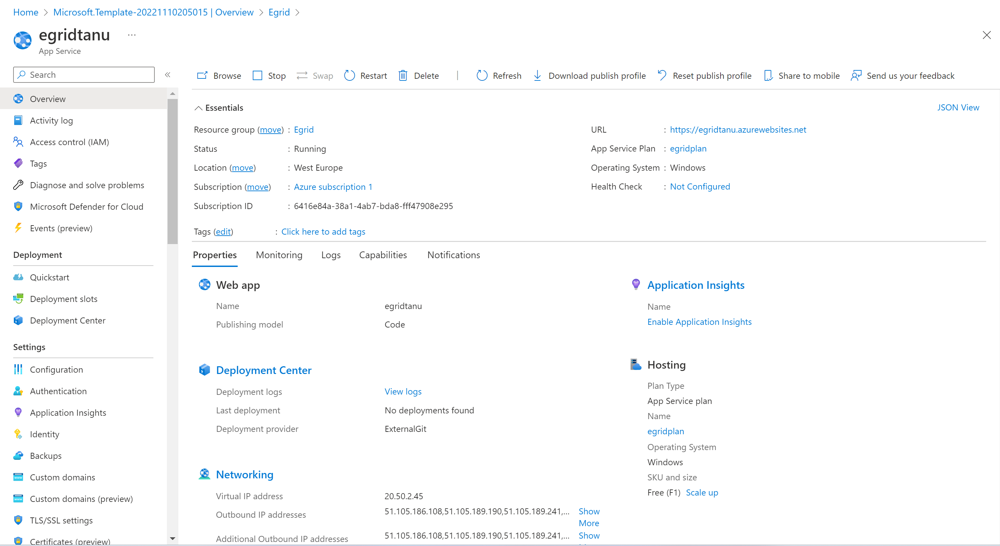
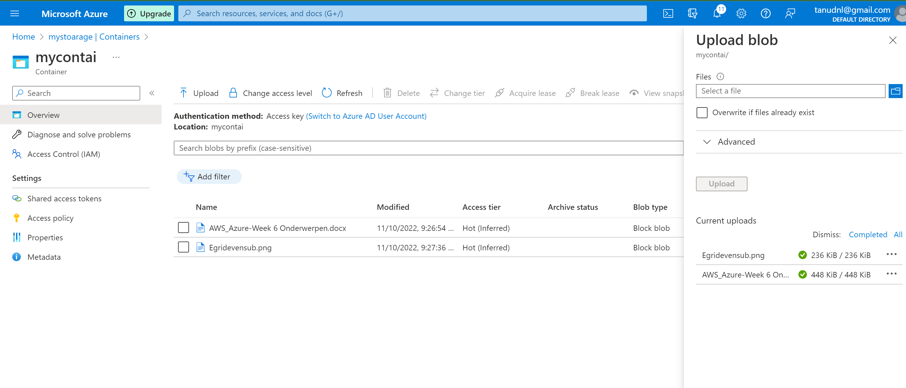

# Azure Event Grid

- Azure Event Grid is a Fully managed event routing service.
- Azure event grid allows for uniform event consumption using a publish subscribe mosel allowing react to relavant events accross both azure and non azure services in near real time fashion.

# Key Concepts
- There are five concepts in Azure Event Grid that let you get going:

    - Events - What happened.
    - Event sources - Where the event took place.
    - Topics - The endpoint where publishers send events.
    - Event subscriptions - The endpoint or built-in mechanism to route events, sometimes to more than one handler. Subscriptions are also used by handlers to intelligently filter incoming events.
    - Event handlers - The app or service reacting to the event. 

# Key Benefits

- **Simplicity** - Point and click to aim events from your Azure resource to any event handler or endpoint.
- **Advanced filtering** - Filter on event type or event publish path to make sure event handlers only receive relevant events.
- **Fan-out** - Subscribe several endpoints to the same event to send copies of the event to as many places as needed.
- **Reliability** - 24-hour retry with exponential backoff to make sure events are delivered.
- **Cost** - only $0.60 per 1000000 per operation.

# Capabilities

- Pay-per-event - Pay only for the amount you use Event Grid.
- High throughput - Build high-volume workloads on Event Grid.
- Built-in Events - Get up and running quickly with resource-defined built-in events.
- Custom Events - Use Event Grid to route, filter, and reliably deliver custom events in your app.

# Source:

(https://learn.microsoft.com/en-us/azure/event-grid/overview)

(https://learn.microsoft.com/en-us/azure/event-grid/blob-event-quickstart-portal)

# Exercise:

- Use Azure Event Grid to route Blob storage events to Azure Portal

