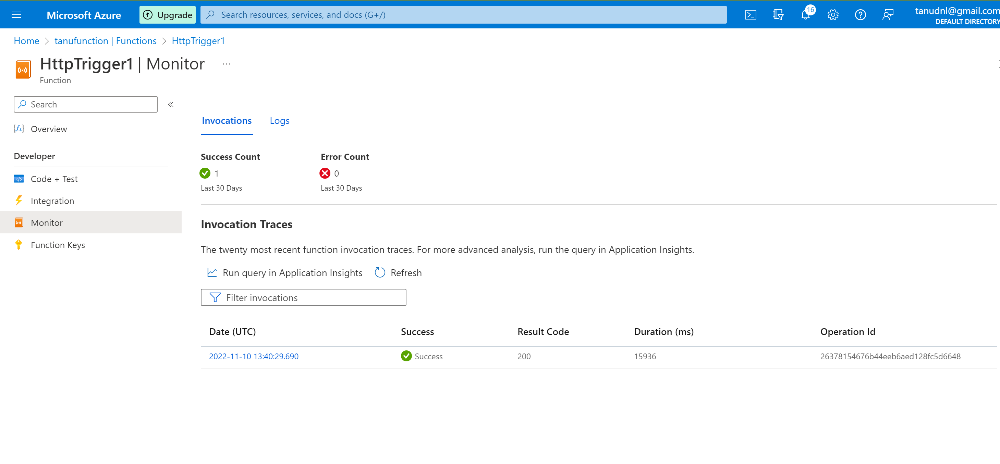

# Azure Functions

- Azure Functions is a solution for easily running small pieces of code,or "functions" in the cloud.
- You can write just the code you need for the problem at hand,without worrying about a whole application or the infrastructure.
- Azure Functions is a serverless solution that allows you to write less code, maintain less infrastructure, and save on costs. Instead of worrying about deploying and maintaining servers, the cloud infrastructure provides all the up-to-date resources needed to keep your applications running.

**Key Features**

- Pay-per-usw pricing model
- Bring your own dependencies(NPM or NUGET)
- Integrated security
- Simple integration
- Flexible devlopment
    - Develop in portal or Visual studio code or any othrt tool
    - Integration with9Github,Azure Devops,etc)
- Open source

**Folder structure**

- The code for all the functions in a specific function app is located in a root project folder that contains a host configuration file. The host.json file contains runtime-specific configurations and is in the root folder of the function app. A bin folder contains packages and other library files that the function app requires. Specific folder structures required by the function app depend on language.

    - C# compiled (.csproj)
    - C# script (.csx)
    - F# script
    - Java
    - JavaScript
    - PowerShell
    - Python

# Exercise:

- Creating Function APP

- Creating a storage account 

!

# Source:

(https://learn.microsoft.com/en-us/azure/azure-functions/functions-overview)

(https://learn.microsoft.com/en-us/azure/azure-functions/functions-reference?tabs=blob)