# Azure Monitors

- Azure Monitors is the service in Azure cloud that helps you increase in the performance and availabilitu of your application and services.
- Azure Monitor receives data from target resources like applications, operating systems, Azure resources, Azure subscriptions, and Azure tenants. The nature of the resource defines which data types are available. A data type will be **a metric, a log, or both a metric and a log.** These data can further be processed to perform different functions such as analysis, visualization, alerting, automation and integrations.

- The focus for metric-based data types is the numerical time-sensitive values that represent some aspect of the target resource.
- The focus for log-based data types is the querying of content data held in structured, record-based log files that are relevant to the target resource.

# Metric:

- Metrics are measures of a resource’s certain characteristics over a given period. For instance, CPU utilization, disk IOPS, number of connections, etc. These are typically real-time, and since they are stored as values with a standard collection interval, they are ideally suitable for viewing as graphs to help you view results over time.

# Logs

- Logs contain time-stamped information about changes made to resources. The type of information recorded varies by log source. The log data is organized into records, with different sets of properties for each type of record. The logs can include numeric values such as Azure Monitor metrics, but most include text data rather than numeric values.

**The Type of data that monitor collects is**

  - Application data
  - Operating system data
  - Azure resource data
  - Azure subscription monitoring data
  - Azure tenant monitoring data
  - Enabling diagnostics
  - Adding an agent

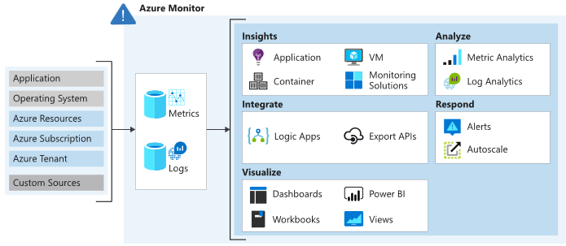

**Azure Key Requirments**

 - Data aggregation
 - Data ingestion
 - Data storage
 - Data processing
 - Data analysis
 - Alerting

 - Created a virtual machine to Monitor the Metrics,Logs,Insight...

 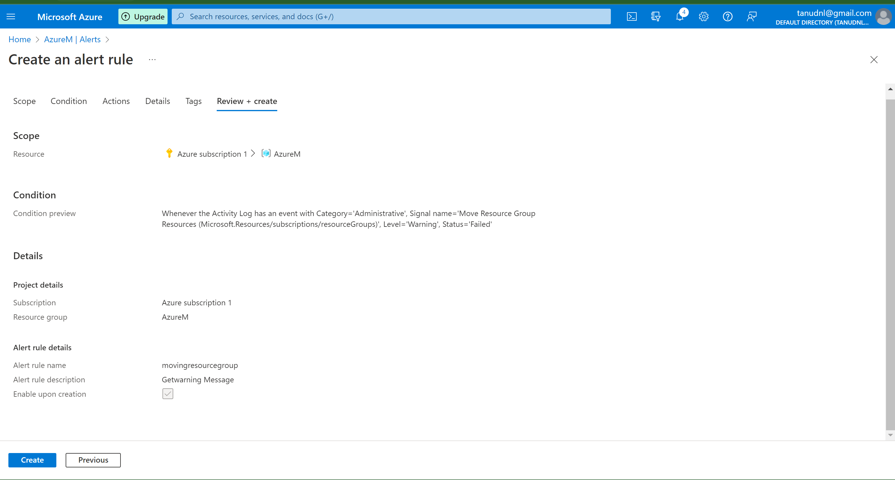

 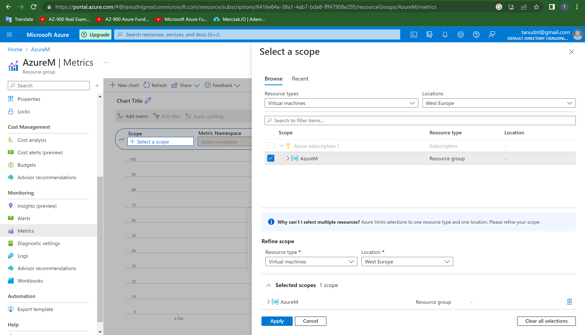

 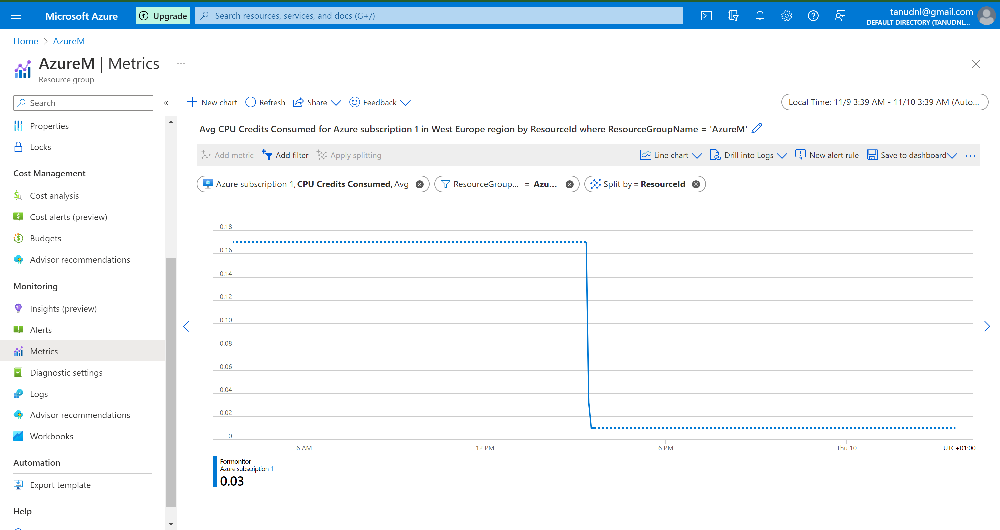

 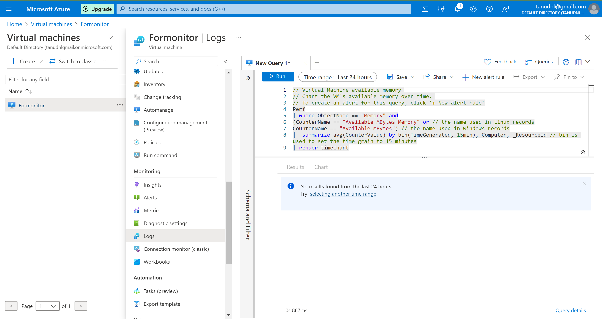

 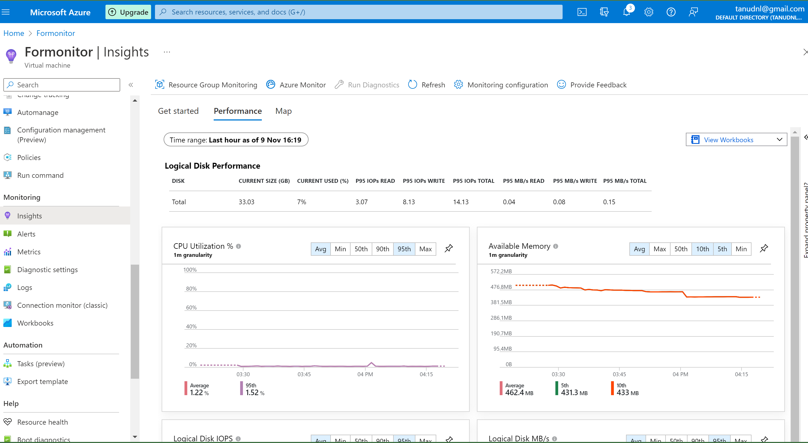

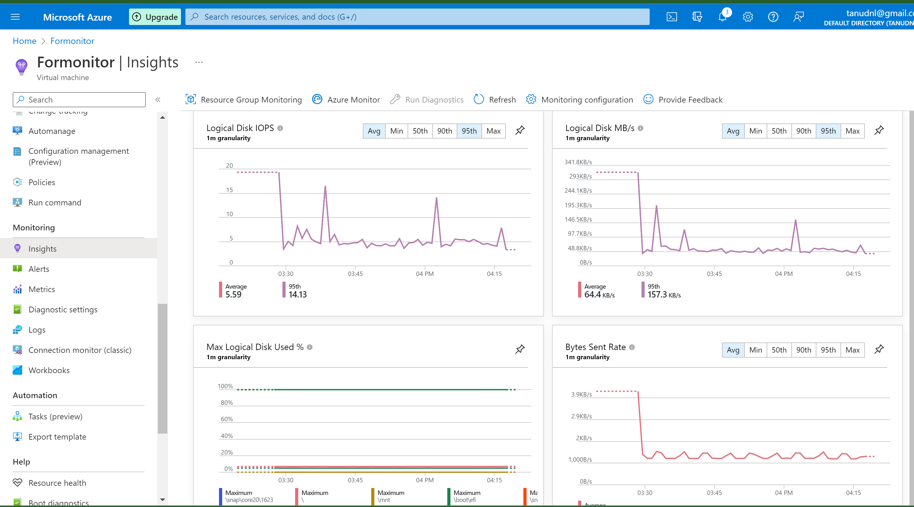

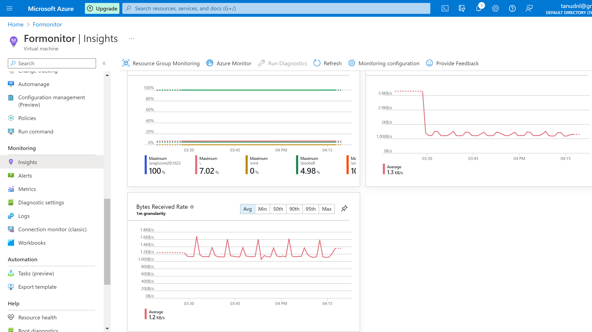

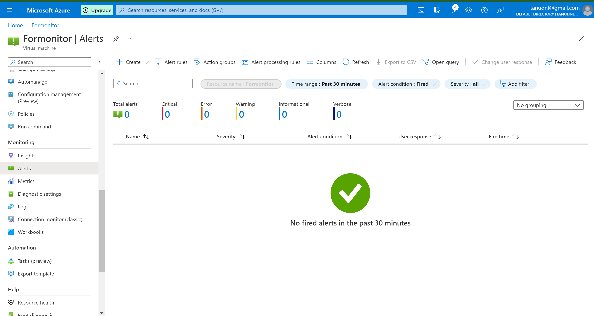

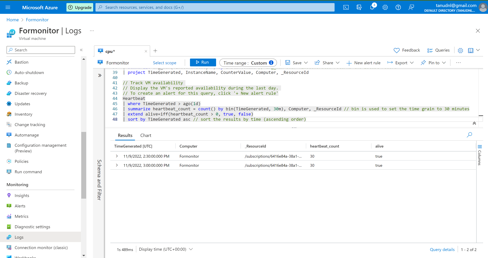

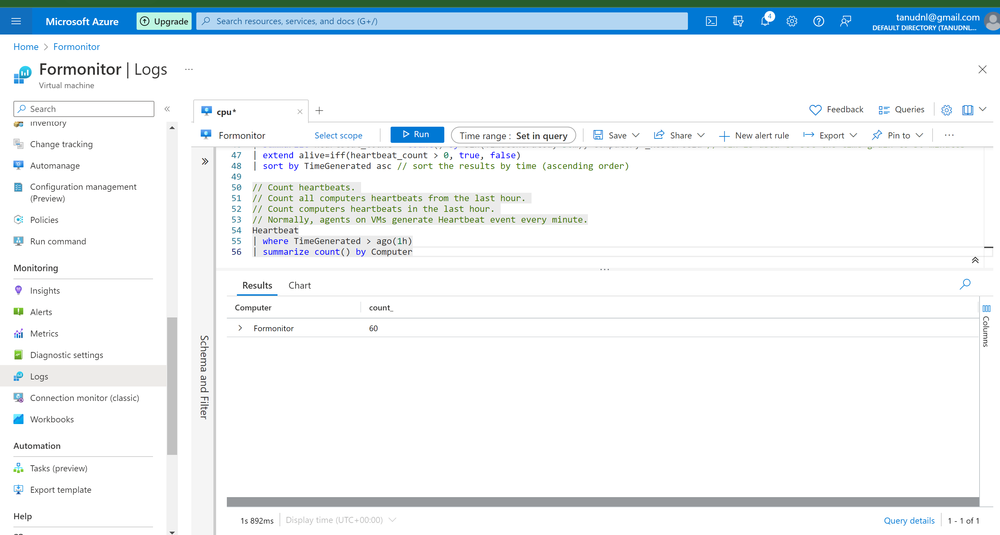

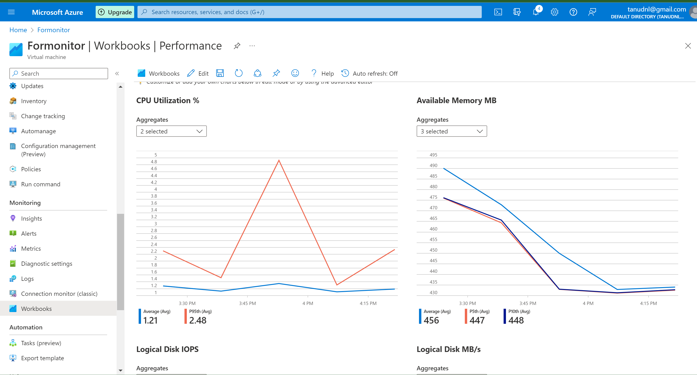

# Source:

(https://learn.microsoft.com/en-us/azure/azure-monitor/overview)

(https://learn.microsoft.com/en-us/azure/azure-monitor/monitor-reference)

(https://learn.microsoft.com/en-us/azure/azure-monitor/logs/data-platform-logs)

(https://learn.microsoft.com/en-us/azure/azure-monitor/app/app-insights-overview?tabs=net)

(https://www.serverless360.com/microsoft-azure-monitoring)