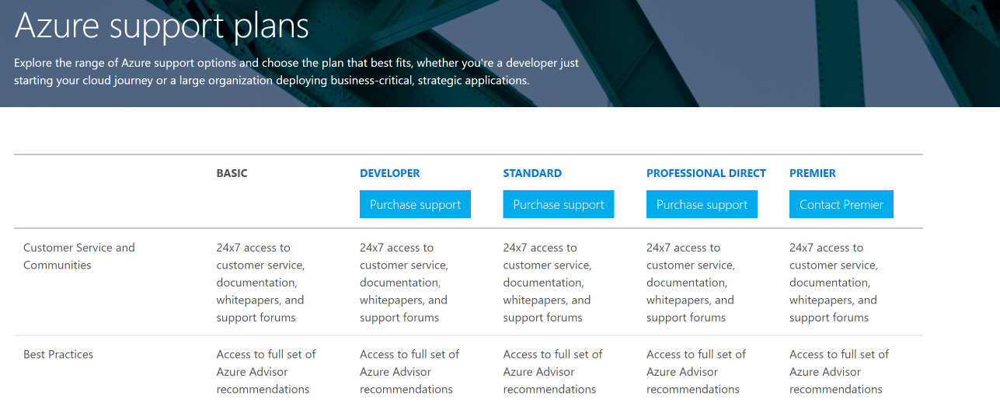
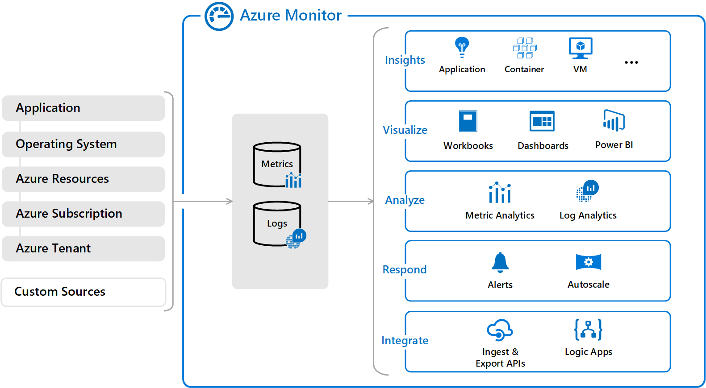

# Containers:
- A container is a strandad unit of software that packages up code and all it's dependency so the applictation runs quikly and reliably from one computing environment to another.

# Virtual Machine:
- It runs on top of an emulating software called the hypervisor which sit between the hardware and the virtual machine. The hypervisor is the key to enable virtualization. It manages the sharing of physical resources into virtual machines. Each virtual machine runs its own guest operating system. They are less agile and have low portability than containers.

# Container:
- It sits on the top of a physical server and its host operating system. They share a common operating system that requires care and feeding for bug fixes and patches. They are more agile and have high portability than virtual machines.

**Differnce between Virtualmachines & Containers:**

- The key differentiator between containers and virtual machines is that virtual machines virtualize an entire machine down to the hardware layers and containers only virtualize software layers above the operating system level.

# Sourc:

(https://learn.microsoft.com/en-us/azure/container-instances/)

(https://www.youtube.com/watch?v=jAWLQFi4USk)

(https://www.geeksforgeeks.org/difference-between-virtual-machines-and-containers/)

(https://www.youtube.com/watch?v=c4nTKMU6fBU&t=50s)

# Azure Support plans:
- Azure support plans and benefits in these plans are utilized by customers, and not transferrable.
- Azure.com only accepts payments by credit and debit cards unless invoicing has been arranged. Azure Prepayment dollars can’t be applied to support plans. Cancellation of support plans won’t result in a prorated refund.
- You’ll be billed monthly for your Azure support plan, which will be automatically renewed. You’ll receive an email notification when your plan’s term is about to renew, and you may disable auto-renewal at any time.

# Source:

(https://www.youtube.com/watch?v=897mxQdfW3g)

(https://azure.microsoft.com/en-au/support/plans/)

# Azure Advisor:

- Advisor is a personalized cloud consultant that helps you follow best practices to optimize your Azure deployments. It analyzes your resource configuration and usage telemetry and then recommends solutions that can help you improve the cost effectiveness, performance, Reliability (formerly called High availability), and security of your Azure resources.
- You can apply filters to display recommendations for specific subscriptions and resource types.

- Reliability (formerly called High Availability): To ensure and improve the continuity of your business-critical applications. 
- Security: To detect threats and vulnerabilities that might lead to security breaches. 
- Performance: To improve the speed of your applications. 
- Cost: To optimize and reduce your overall Azure spending.
- Operational Excellence: To help you achieve process and workflow efficiency, resource manageability and deployment best practices.

**Key Characterstics:**
- Personalized consultant service
- Designed to provide recommendations and best practices for
       - Cost (SKU sizes, idle services, reserved instances, etc.)
       - Security (MFA settings, vulnerability settings, agent installations, etc.)
       - Reliability (redundancy settings, soft delete on blobs, etc.)
       - Performance (SKU sizes, SDK versions, IO throttling, etc.)
       - Operational Excellence (service health, subscription limits, etc.)
- Actionable recommendations
- Free.

# Source:

 (https://learn.microsoft.com/en-us/azure/advisor/advisor-overview)

# App Configuration:
- Applications running in the cloud have many distributed components. By centralizing application settings and feature flags you can reduce operational costs and complexity of your solutions. Azure App Configuration service delivers all that in simple and clean manner.

# Key benefits from app configuration:
- Quick setup
- Tagging with lables
- Point in time reply of settings
- Feature flag managment
- Configuration comarision
- Integration with managed identity
- Data encryption
- Key valut refernces

# Source:

 (https://learn.microsoft.com/en-us/azure/azure-app-configuration/overview)

 (https://learn.microsoft.com/en-us/azure/azure-app-configuration/faq?source=recommendations)

 # Activity Log

 - Activity log insights provide you with a set of dashboards that monitor the changes to resources and resource groups in a subscription. The dashboards also present data about which users or services performed activities in the subscription and the activities' status.

 **Azure Monitor**

 - Azure Monitor is based on a common monitoring data platform that includes

   - Metrics
   - Logs
   - Traces
   - Changes. This platform allows data from multiple resources to be analyzed together using a common set of tools in Azure Monitor.

   

# Source:

 (https://learn.microsoft.com/en-us/azure/azure-monitor/essentials/activity-log-insights)

 (https://learn.microsoft.com/en-us/azure/azure-monitor/data-sources?source=recommendations)

