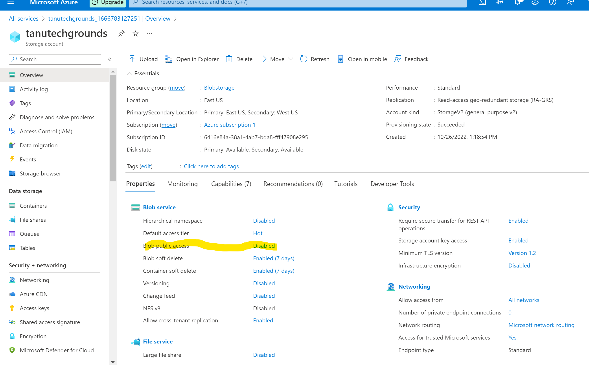
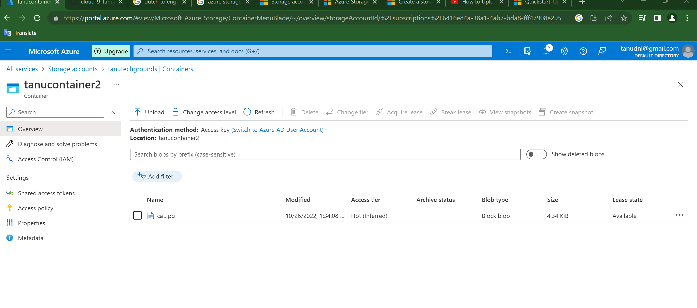

# Azure Storage Account

# Introduction
- An Azure storage account contains all of your Azure Storage data objects, including blobs, file shares, queues, tables, and disks. The storage account provides a unique namespace for your Azure Storage data that's accessible from anywhere in the world over HTTP or HTTPS. Data in your storage account is durable and highly available, secure, and massively scalable.
- Azure Storage offers several types of storage accounts. Each type supports different features and has its own pricing model.
- Storage account names must be between 3 and 24 characters in length and may contain numbers and lowercase letters only.
- Your storage account name must be unique within Azure. No two storage accounts can have the same name.
- There are two types of service endpoints available for a storage account:

  - Standard endpoints (recommended): You can create up to 250 storage accounts per region with standard endpoints in a given subscription.
  - Azure DNS zone endpoints (preview): You can create up to 5000 storage accounts per region with Azure DNS zone endpoints in a given subscription.

**Standard endpoints**
 - A standard service endpoint in Azure Storage includes the protocol (HTTPS is recommended), the storage account name as the subdomain, and a fixed domain that includes the name of the service.

# Exercise
- Create an Azure Storage Account. Make sure that only you have access to the data.

- I was abel to create storage account with private access using the tutorial provided by Mycrosoft.

# Result

- Place data in a storage service of your choice via the console (for example a cat photo in Blob storage).

- Retrieve the data to your own computer using the Azure Storage Explorer.

# Overcome challenges
- I was abel to create and add image in the storage service with out any issues.To retrive the data i missed the part where i have to download storage explorer tool.
- Once i down loaded and trying to add resource to the explorer i got the error *no subscriptions found*

# Source
(https://learn.microsoft.com/en-us/azure/storage/common/storage-account-overview)

(https://azure.microsoft.com/en-us/products/storage/storage-explorer/#features)

(https://learn.microsoft.com/en-us/azure/storage/common/storage-account-create?tabs=azure-portal)

(https://learn.microsoft.com/en-us/azure/storage/blobs/soft-delete-blob-manage?tabs=dotnet)
