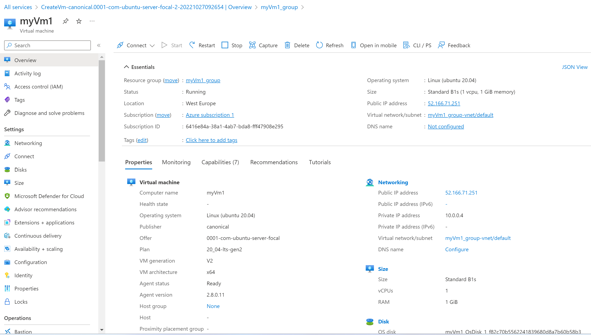
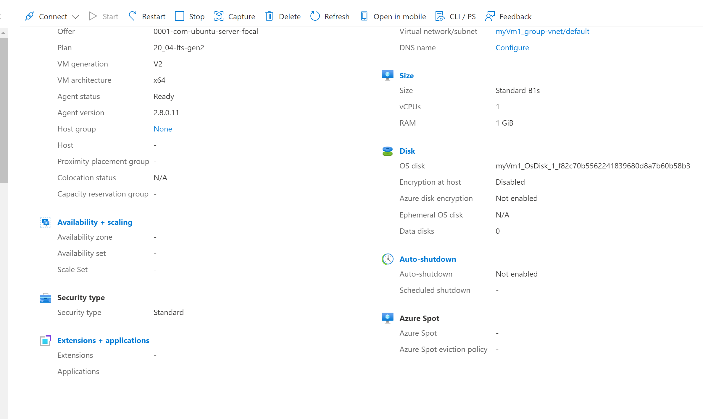
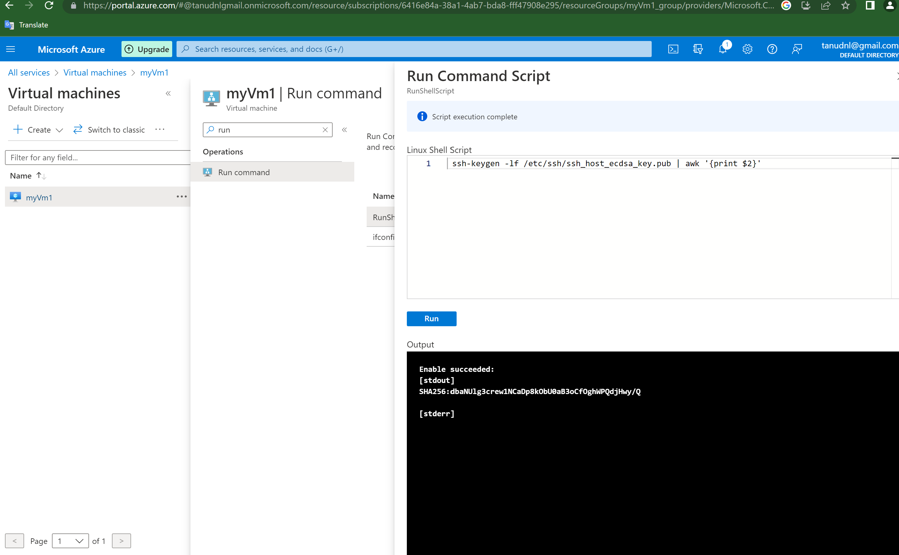
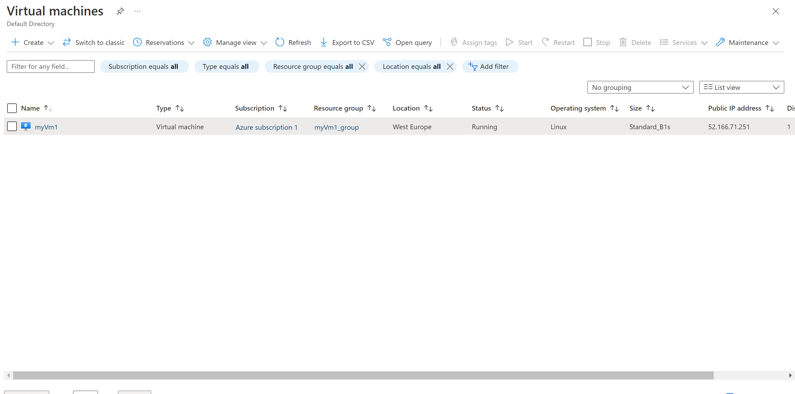

# Azure Virtual Machines

- Azure virtual machines are one of several types of on-demand, scalable computing resources that Azure offers. Typically, you choose a virtual machine when you need more control over the computing environment than the other choices offer.
- An Azure virtual machine gives you the flexibility of virtualization without having to buy and maintain the physical hardware that runs it. You still need to maintain the virtual machine by performing tasks, such as configuring, patching, and installing the software that runs on it.

- Azure virtual machines can be used in various ways   

    - *Development and test* – Azure virtual machines offer a quick and easy way to create a computer with specific configurations required to code and test an application.
    - *Applications in the cloud* – Because demand for your application can fluctuate, it might make economic sense to run it on a virtual machine in Azure. You pay for extra virtual machines when you need them and shut them down when you don’t.
    - *Extended datacenter* – virtual machines in an Azure virtual network can easily be connected to your organization’s network.

 # What do I need to think about before creating a virtual machine?
- There is always a multitude of design considerations when buliding a virtual machine. 

   - The names of your application resources
   - The location where the resources are stored   
   - The size of the virtual machine
   - The maximum number of virtual machines that can be created
   - The operating system that the virtual machine runs
   - The configuration of the virtual machine after it starts
   - The related resources that the virtual machine needs   
**Locations**

- There are multiple geographical regions around the world where you can create Azure resources. Usually, the region is called location when you create a virtual machine. For a virtual machine, the location specifies where the virtual hard disks will be stored.
**Availability**

- There are multiple options to manage the availability of your virtual machines in Azure.

   - Availability Zones are physically separated zones within an Azure region. Availability zones guarantee you will have virtual machine Connectivity to at least one instance at least 99.99% of the time when you have two or more instances deployed across two or more Availability Zones in the same Azure region.
   - Azure virtual machine scale sets let you create and manage a group of load balanced VMs. The number of VM instances can automatically increase or decrease in response to demand or a defined schedule. Scale sets provide the following key benefits:

        - Easy to create and manage multiple VMs
        - Provides high availability and application resiliency by distributing VMs across availability zones or fault domains
        - Allows your application to automatically scale as resource demand changes
        - Works at large-scale
**Sizes and pricing**

- The size of the virtual machine that you use is determined by the workload that you want to run.
**Virtual machine limits**

- Your subscription has default quota limits in place that could impact the deployment of many virtual machines for your project. The current limit on a per subscription basis is 20 virtual machines per region.
**Managed Disks**

- Managed Disks handles Azure Storage account creation and management in the background for you, and ensures that you do not have to worry about the scalability limits of the storage account.
**Distributions**

- Microsoft Azure supports a variety of Linux and Windows distributions. You can find available distributions in the marketplace, Azure portal or by querying results using CLI, PowerShell and REST APIs.
**Cloud-init**

- Azure supports for cloud-init across most Linux distributions that support it.
**Data residency**

- In Azure, the feature to enable storing customer data in a single region is currently only available in the Southeast Asia Region (Singapore) of the Asia Pacific Geo and Brazil South (Sao Paulo State) Region of Brazil Geo. For all other regions, customer data is stored in Geo.

**Azure storagr**

- The Azure Storage platform is Microsoft's cloud storage solution for modern data storage scenarios. Azure Storage offers highly available, massively scalable, durable, and secure storage for a variety of data objects in the cloud. Azure Storage data objects are accessible from anywhere in the world over HTTP or HTTPS via a REST API.

**Azure vnet**

- Azure Virtual Network (VNet) is the fundamental building block for your private network in Azure. VNet enables many types of Azure resources, such as Azure Virtual Machines (VM), to securely communicate with each other, the internet, and on-premises networks.
- All resources in a VNet can communicate outbound to the internet, by default. You can communicate inbound to a resource by assigning a public IP address or a public Load Balancer.

*Open ports and endpoints to a VM with the Azure CLI*

- You open a port, or create an endpoint, to a virtual machine (VM) in Azure by creating a network filter on a subnet or VM network interface. You place these filters, which control both inbound and outbound traffic, on a Network Security Group attached to the resource that receives the traffic.

# Source

(https://learn.microsoft.com/en-us/azure/virtual-machines/overview)

(https://learn.microsoft.com/en-us/azure/virtual-machines/)

(https://learn.microsoft.com/en-us/azure/virtual-machine-scale-sets/overview)

(https://learn.microsoft.com/en-us/azure/storage/common/storage-introduction)

(https://learn.microsoft.com/en-us/azure/virtual-network/virtual-networks-overview)

(https://learn.microsoft.com/en-us/azure/virtual-machines/linux/nsg-quickstart)

(https://learn.microsoft.com/en-us/azure/virtual-machines/windows/quick-create-portal)

(https://learn.microsoft.com/en-us/azure/virtual-machines/linux/ssh-from-windows)

(https://learn.microsoft.com/en-us/azure/bastion/bastion-connect-vm-ssh-linux)

(https://learn.microsoft.com/en-us/azure/virtual-machines/linux-vm-connect?tabs=Linux)

# Exercise
- Create a VM with the following requirements:
    - Ubuntu Server 20.04 LTS - Gen1
    - Size: Standard_B1ls
    -  Allowed inbound ports:
    - HTTP (80)
    - SSH (22)
    -  OS Disk type: Standard SSD
    -  Networking: defaults
    - Boot diagnostics are not necessary
    - Custom dates:

# Result

