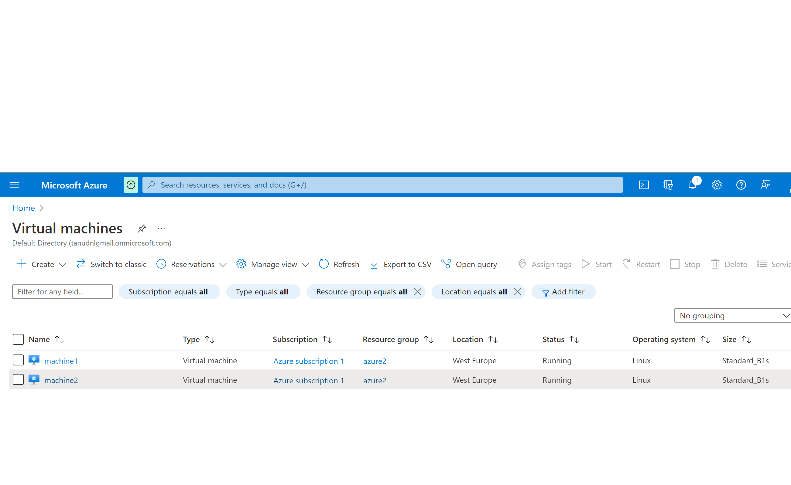
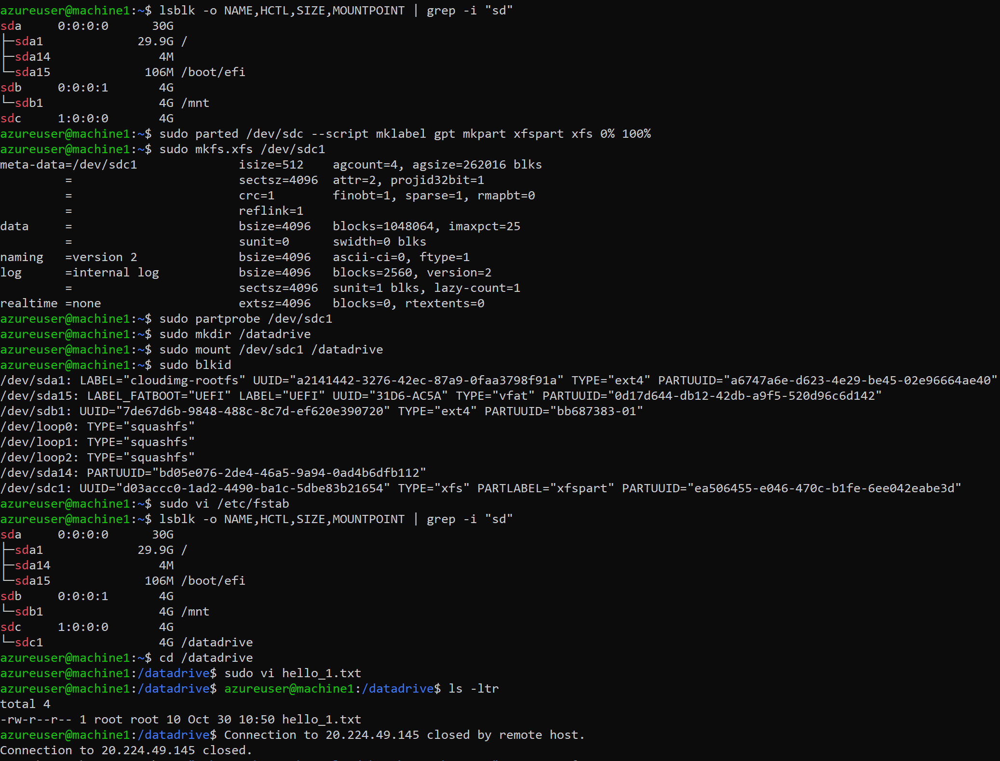
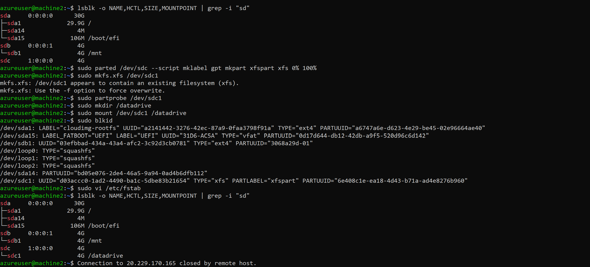
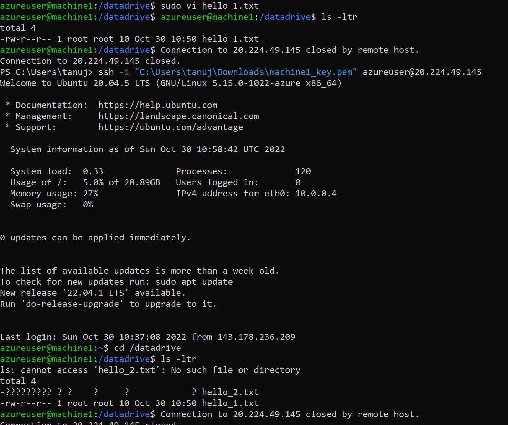
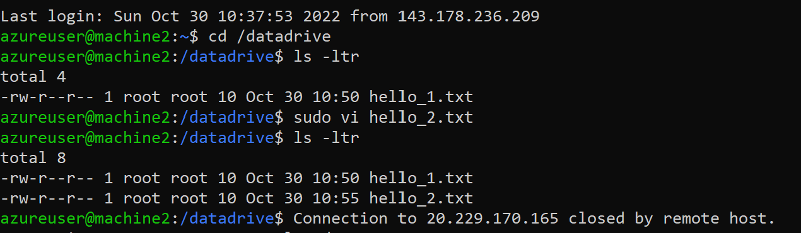
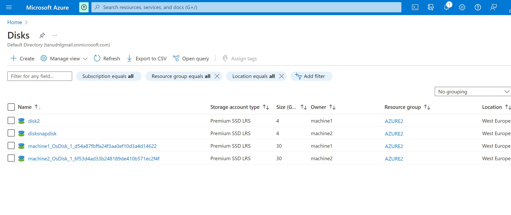
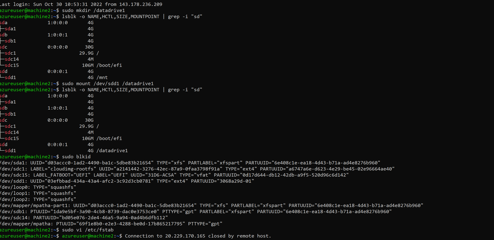

# Azure Disk Storage

# Introduction:

- Azure Disk Storage is the only shared cloud block storage that supports both Windows and Linux-based clustered or high-availability applications via Azure shared disks. Learn how shared disks enables you to run your mission-critical workloads in Azure.
- Azure managed disks currently offers five disk types, each intended to address a specific customer scenario:

  - Ultra disks
  - Premium SSD v2
  - Premium SSDs (solid-state drives)
  - Standard SSDs
  - Standard HDDs (hard disk drives)

# Ultra disks:
- Azure ultra disks are the highest-performing storage option for Azure virtual machines (VMs). You can change the performance parameters of an ultra disk without having to restart your VMs.
- Ultra disks must be used as data disks and can only be created as empty disks. You should use Premium solid-state drives (SSDs) as operating system (OS) disks.

# Premium SSD v2
- Azure Premium SSD v2 is designed for IO-intense enterprise workloads that require consistent sub-millisecond disk latencies and high IOPS and throughput at a low cost.
- Premium SSD v2 limitations
   - Premium SSD v2 disks can't be used as an OS disk.
   - Currently, Premium SSD v2 disks can only be attached to zonal VMs.
   - Currently, taking snapshots aren't supported, and you can't create    Premium SSD v2 from the snapshot of another disk type.
   - Currently, Premium SSD v2 disks can't be attached to VMs with encryption at host enabled.
  - Azure Disk Encryption isn't supported for VMs with Premium SSD v2 disks.
   - Currently, Premium SSD v2 disks can't be attached to VMs in Availability Sets.
  - Azure Backup and Azure Site Recovery aren't supported for VMs with Premium SSD v2 disks.
*Regional availability*
- Currently only available in the following regions:

- US East
- West Europe
# Premium SSDs
Azure Premium SSDs deliver high-performance and low-latency disk support for virtual machines (VMs) with input/output (IO)-intensive workloads.
# Standard SSDs
Azure standard SSDs are optimized for workloads that need consistent performance at lower IOPS levels. They're an especially good choice for customers with varying workloads supported by on-premises hard disk drive (HDD) solutions.
# Standard HDDs
Azure standard HDDs deliver reliable, low-cost disk support for VMs running latency-tolerant workloads. With standard storage, your data is stored on HDDs, and performance may vary more widely than that of SSD-based disks. 

# Exercise:

- Start 2 Linux VMs. Zorgt dat je voor beide toegang hebt via SSH
- Maak een Azure Managed Disk aan en koppel deze aan beide VMs tegelijk.

- Creëer op je eerste machine een bestand en plaats deze op de Shared Disk.
- Kijk op de tweede machine of je het bestand kan lezen.

- Maak een snapshot van de schijf en probeer hier een nieuwe Disk mee te maken
- Mount deze nieuwe Disk en bekijk het bestand

# Overcome challenges:
- I had faced multiple issues while doing this exercise.I took more time to finsih this assignment.

# Source
(https://learn.microsoft.com/en-us/azure/virtual-machines/disks-types)

(https://github.com/Huachao/azure-content/blob/master/articles/virtual-machines/virtual-machines-linux-how-to-attach-disk.md)

(https://learn.microsoft.com/en-us/azure/virtual-machines/linux/attach-disk-portal)

