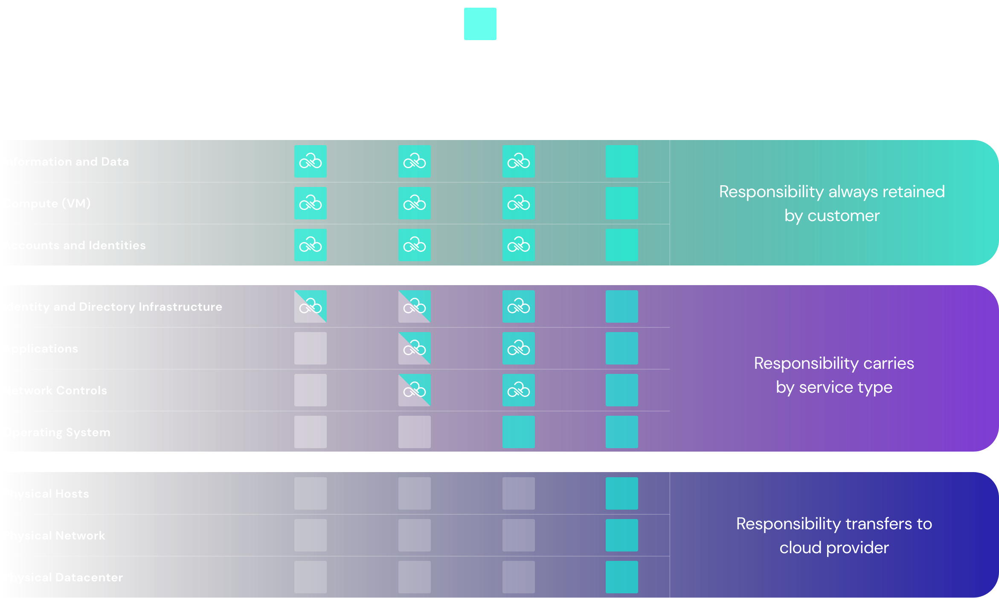

# Shared Responsibility Model

# Introduction:

- The workload responsibilities vary depending on whether the workload is hosted on Software as a Service (SaaS), Platform as a Service (PaaS), Infrastructure as a Service (IaaS), or in an on-premises datacenter.
- Azure takes care of the security ‘of’ the cloud while Azure customers are responsible for security ‘in’ the cloud.

# What is Microsoft Azure Shared Responsibility ‘of’ the Cloud?

- Azure is focused on the security of the underlying infrastructure, by protecting its computing, storage, networking, and database services against intrusions. Azure is also responsible for the security of the software, hardware, and physical facilities that host Azure services. The Azure cloud security framework takes responsibility for the security configuration of its managed services such as Azure Kubernetes Service (AKS), Container Instances, Cosmos DB, SQL, Data Lake Storage, Blob Storage, and others.

# What is the Customer Responsibility ‘in’ Azure?
- Azure customers are responsible for the security “in their own cloud, or more simply put, everything that they instantiate, build and/or use.
- while Azure has built several layers of security features to prevent unauthorized access to Azure, including multi-factor authentication, it is the customer’s responsibility to make sure multi-factor authentication is turned on for users, particularly for those with the most extensive IAM permissions in Azure.

# Division of Responsibility: Azure Cloud Security Framework
- In an on-premises data center, the customer owns the whole stack. As you move to the cloud some responsibilities transfer to Microsoft Azure.
- For all cloud deployment types, you own your data and identities. You are responsible for protecting the security of your data and identities, on-premises resources, and the cloud components you control.

 **Regardless of the type of deployment, the following responsibilities are always retained by you, the Azure customer:**

   - Data
   - Endpoints
   - Account
   - Access management

   

# Source:

(https://learn.microsoft.com/en-us/azure/security/fundamentals/shared-responsibility)

(https://sonraisecurity.com/blog/azure-shared-responsibility/)

(https://subscription.packtpub.com/book/security/9781800562653/2/ch02lvl1sec04/shared-responsibility-model)

