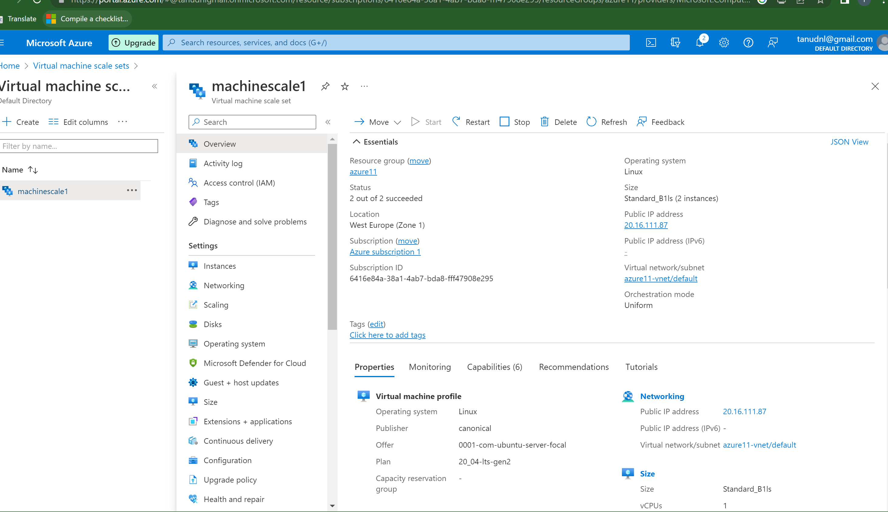
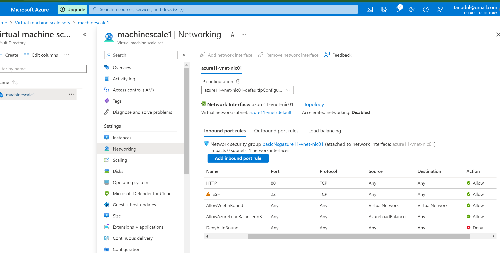
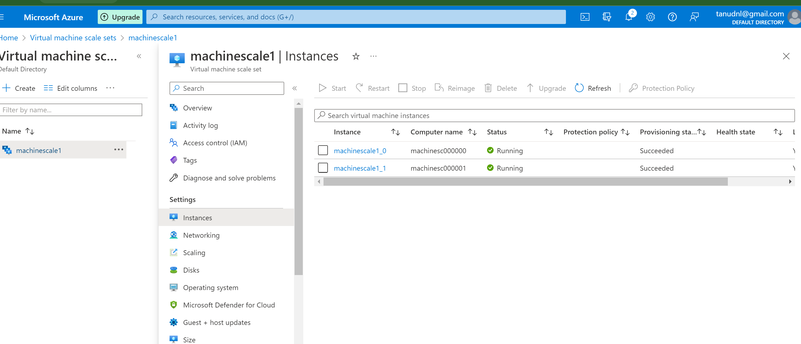
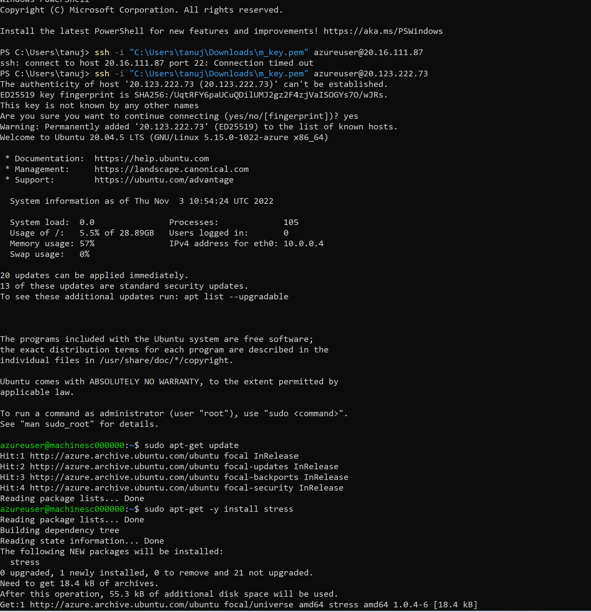
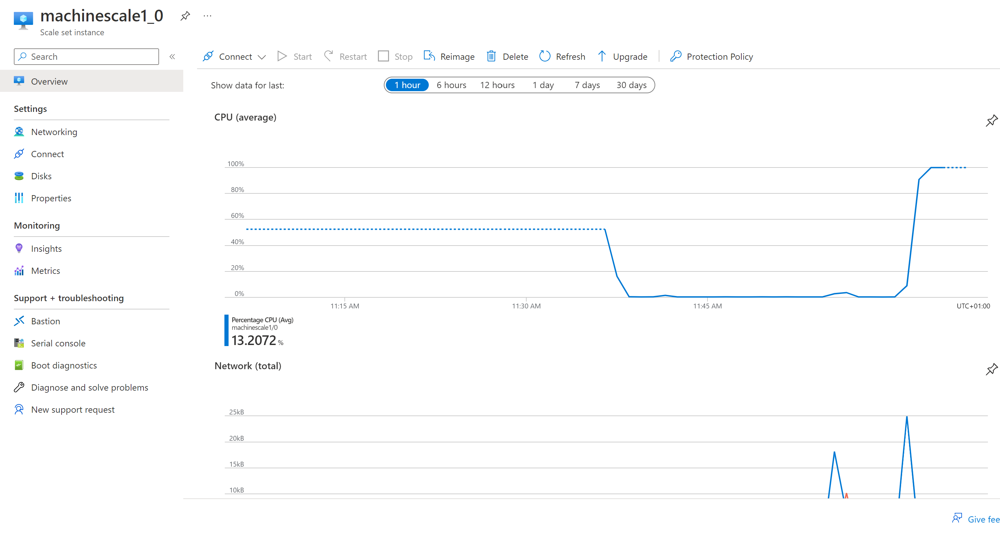
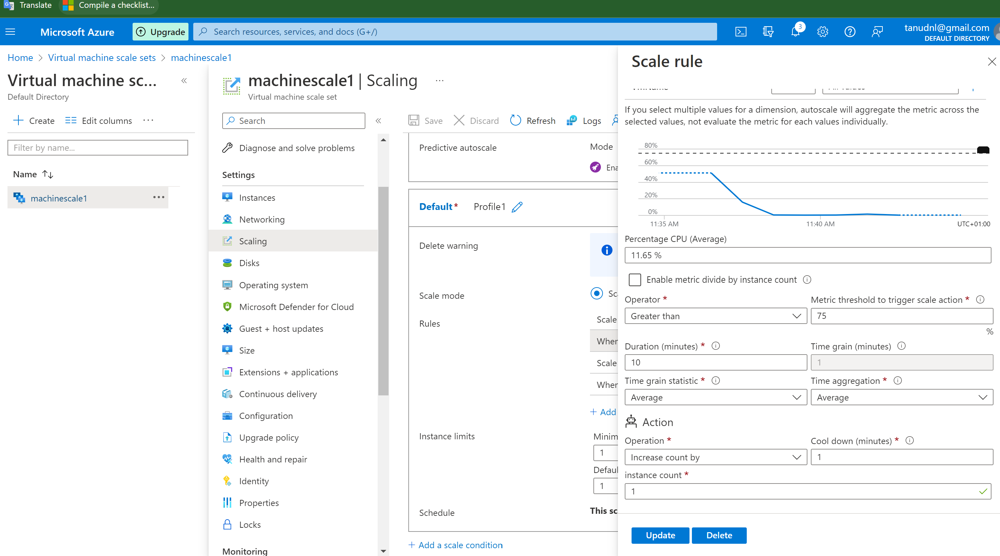

# AutoScaling&LoadBalancer

- Autoscaling is the process of dynamically allocating resources to match performance requirements. As the volume of work grows, an application may need additional resources to maintain the desired performance levels and satisfy service-level agreements (SLAs).
- There are two main ways that an application can scale:
     - Vertical scaling:Vertical scaling also called scaling up and down, means changing the capacity of a resource.
     - Horizontal scalling:is called scaling out and in, means adding or removing instances of a resource. The application continues running without interruption as new resources are provisioned.

# Autoscaling components
 - An autoscaling strategy typically involves the following pieces:

     - Instrumentation and monitoring systems at the application, service, and infrastructure levels. These systems capture key metrics, such as response times, queue lengths, CPU utilization, and memory usage.
     - Decision-making logic that evaluates these metrics against     predefined thresholds or schedules, and decides whether to scale.
      Components that scale the system.
     - Testing, monitoring, and tuning of the autoscaling strategy to ensure that it functions as expected.

# What is Azure Load Balancer:
- Load balancing refers to evenly distributing load (incoming network traffic) across a group of backend resources or servers.
- Azure Load Balancer operates at layer 4 of the Open Systems Interconnection (OSI) model. It's the single point of contact for clients.

 **public load balancer** can provide outbound connections for virtual machines (VMs) inside your virtual network. These connections are accomplished by translating their private IP addresses to public IP addresses. Public Load Balancers are used to load balance internet traffic to your VMs.

 **internal (or private) load balancer** is used where private IPs are needed at the frontend only. Internal load balancers are used to load balance traffic inside a virtual network. A load balancer frontend can be accessed from an on-premises network in a hybrid scenario.

 **Why use Azure Load Balancer?**
- With Azure Load Balancer, you can scale your applications and create highly available services. Load balancer supports both inbound and outbound scenarios

   - Load balance internal and external traffic to Azure virtual machines.

   - Increase availability by distributing resources within and across zones.

   - Configure outbound connectivity for Azure virtual machines.

   - Use health probes to monitor load-balanced resources.

   - Employ port forwarding to access virtual machines in a virtual network by public IP address and port.

   - Enable support for load-balancing of IPv6.

   - Standard load balancer provides multi-dimensional metrics through Azure Monitor. These metrics can be filtered, grouped, and broken out for a given dimension. 
   - Load balance services on multiple ports, multiple IP addresses, or both.

   - Move internal and external load balancer resources across Azure regions.

   - Load balance TCP and UDP flow on all ports simultaneously using HA ports.

# Exercise:

- Opdracht 1:
   - Maak een Virtual Machine Scale Set met de volgende vereisten:
   -	Ubuntu Server 20.04 LTS - Gen1
   -	Size: Standard_B1ls
   -	Allowed inbound ports:
   -	SSH (22)
   - HTTP (80)
   -	OS Disk type: Standard SSD
   -	Networking: defaults
   -	Boot diagnostics zijn niet nodig
   -	Custom data: 
	#!/bin/bash

   - Initial Instance Count: 2
   - Scaling Policy: Custom
   - Aantal VMs: minimaal 1 en maximaal 4
   - Voeg een VM toe bij 75% CPU gebruik
   - Verwijder een VM bij 30% CPU gebruik

   !

   

   

   

   

   

   

   

# Source:

(https://learn.microsoft.com/en-us/azure/architecture/best-practices/auto-scaling)

(https://learn.microsoft.com/en-us/azure/load-balancer/load-balancer-overview)

(https://stackoverflow.com/questions/27810081/do-i-need-load-balancer-if-my-azure-websites-autoscale-is-enabled)

(https://learn.microsoft.com/en-us/azure/virtual-machine-scale-sets/quick-create-portal)

(https://www.youtube.com/watch?v=sCR3SAVdyCc)

(https://learn.microsoft.com/en-us/azure/virtual-machine-scale-sets/virtual-machine-scale-sets-scale-in-policy)

(https://learn.microsoft.com/en-us/azure/load-testing/quickstart-create-and-run-load-test)

(https://learn.microsoft.com/en-us/azure/load-testing/overview-what-is-azure-load-testing)

