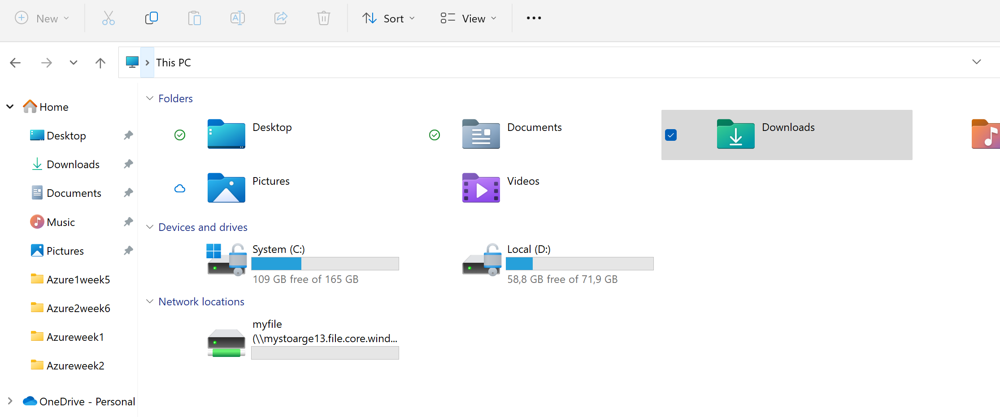
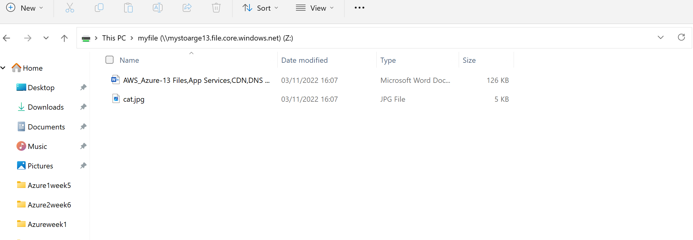
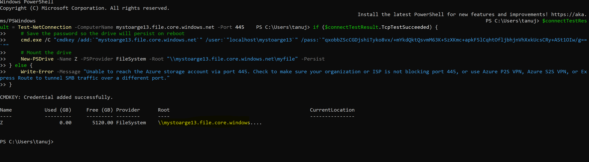
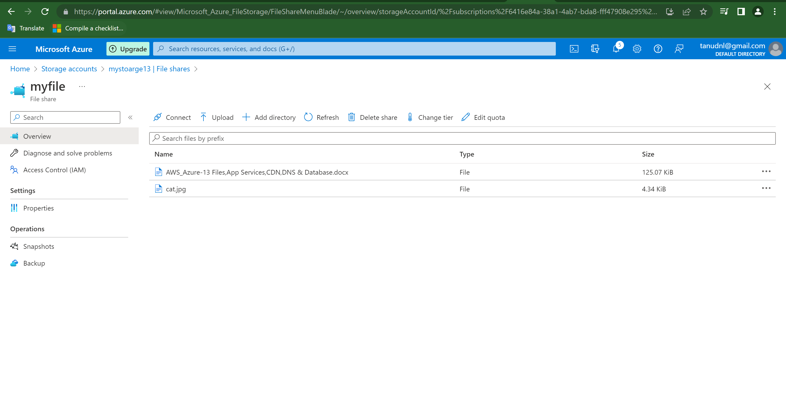
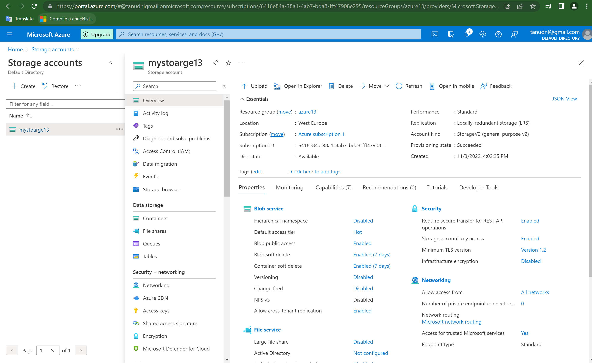

# Files,AppServices,CDN,DNS,Database

# Azure Files:
- Azure Files offers fully managed file shares in the cloud that are accessible via the industry standard Server Message Block (SMB) protocol, Network File System (NFS) protocol, and Azure Files REST API. Azure file shares can be mounted concurrently by cloud or on-premises deployments.

**SMB(Server message protocol):**
- The Server Message Block (SMB) Protocol is a network file sharing protocol, and as implemented in Microsoft Windows is known as Microsoft SMB Protocol. The set of message packets that defines a particular version of the protocol is called a dialect. The Common Internet File System (CIFS) Protocol is a dialect of SMB. Both SMB and CIFS are also available on VMS, several versions of Unix, and other operating systems.

**NFS(Network file system):**
- Network File System (NFS) is a distributed file system protocol originally developed by Sun Microsystems (Sun) in 1984,[1] allowing a user on a client computer to access files over a computer network much like local storage is accessed

**Azure files rest API:**
- Azure Files provides hosted cloud file shares that you can access (mount) by using industry-standard file system protocols such as SMB and NFS. When you mount a file share on your computer by using SMB or NFS, your operating system redirects API requests for the local file system. The redirection includes local API requests that you make by using.
- Azure Files also provides a REST API, which is often called the FileREST API. It provides another method of accessing data stored in Azure file shares.

# Azure Fileservices
- Microsoft Azure File Service is a is a cloud storage service that allows Windows Server administrators to access Server-Message-Block-Protocol (SMB) shares in the Azure cloud by setting up file shares in the Azure management console.
- Azure File Service can be a shared resource so test machines and development have access to one file share when installing tools, applications and utilities.
- Azure File Service can be the central location in which applications leave configuration files.
- An Azure File Service share can be deployed to become the place for applications to store monitoring files, including crash dumps and logs.

# AZure App Services:
- Azure App Service is an HTTP-based service for hosting web applications, REST APIs, and mobile back ends. You can develop in your favorite language, be it .NET, .NET Core, Java, Ruby, Node.js, PHP, or Python. Applications run and scale with ease on both Windows and Linux-based environments.
- App Service not only adds the power of Microsoft Azure to your application, such as security, load balancing, autoscaling, and automated management.

# Azure CDN
- A content delivery network (CDN) is a distributed network of servers that can efficiently deliver web content to users. 
- Azure Content Delivery Network (CDN) offers developers a global solution for rapidly delivering high-bandwidth content to users by caching their content at strategically placed physical nodes across the world.

# Azure DNS
- Azure DNS is a hosting service for DNS domains that provides name resolution by using Microsoft Azure infrastructure. By hosting your domains in Azure, you can manage your DNS records by using the same credentials, APIs, tools, and billing as your other Azure services.

# Azure Managed Instances:
- Azure SQL Managed Instance is de intelligente, schaalbare clouddatabaseservice die de breedste compatibiliteit met SQL Server-database-engine biedt met alle voordelen van een volledig beheerd en 'evergreen' platform-as-a-service. MeSQL Managed Instance is vrijwel 100% compatibel met de meest recente (Enterprise Edition) SQL Server-database-engine.

# Exercise:
# File services:

# Source:
(https://learn.microsoft.com/en-us/azure/storage/files/storage-files-introduction)

(https://www.youtube.com/watch?v=36KZWO6cnXQ)

(https://learn.microsoft.com/en-us/azure/storage/common/storage-account-create?tabs=azure-portal)

(https://learn.microsoft.com/en-us/azure/cdn/cdn-overview)

(https://learn.microsoft.com/en-us/azure/dns/dns-overview)

(https://learn.microsoft.com/nl-nl/azure/azure-sql/managed-instance/sql-managed-instance-paas-overview?view=azuresql)

