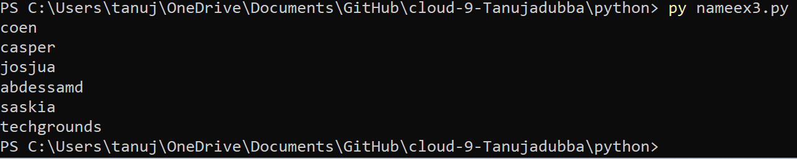

loops.md

# LOOPS

# Introduction

- If you want to write an algorithm that follows the same set of instructions for multiple iterations.
- There are two types of loops in python:

 - While loop:With the while loop we can execute a set of statements as long as a condition is true.

 - For loop:A for loop is used for iterating over a sequence (that is either a list, a tuple, a dictionary, a set, or a string).

This is less like the for keyword in other programming languages, and works more like an iterator method as found in other object-orientated programming languages.

With the for loop we can execute a set of statements, once for each item in a list, tuple, set etc.

# Key termynology

- while loop
- For loop
- Array

# Source

(https://www.w3schools.com/python/python_for_loops.asp)

(https://www.w3schools.com/python/python_while_loops.asp)

(https://www.w3schools.com/python/python_arrays.asp)

# Exercise1

- Create a new script.
-	Create a variable x and give it the value 0.
-	Use a while loop to print the value of x in every iteration of the loop. After printing, the value of x should increase by 1. The loop should run as long as x is smaller than or equal to 10.

[ "whileex1.png"]

# Exercise2

- Print the value of i in the for loop. You did not manually assign a value to i. Figure out how its value is determined.
-	Add a variable x with value 5 at the top of your script.
-	Using the for loop, print the value of x multiplied by the value of i, for up to 50 iterations.

[ "forloop.png"]

[ "forloopmulti.png"]

# Exercise3

 - Use a for loop to loop over the array. Print every name individually

[ "listofname.png"]

