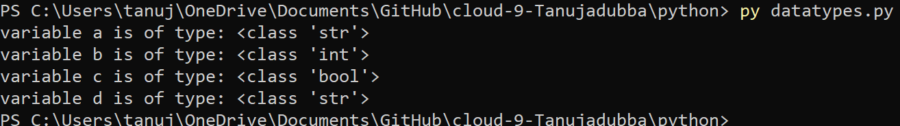
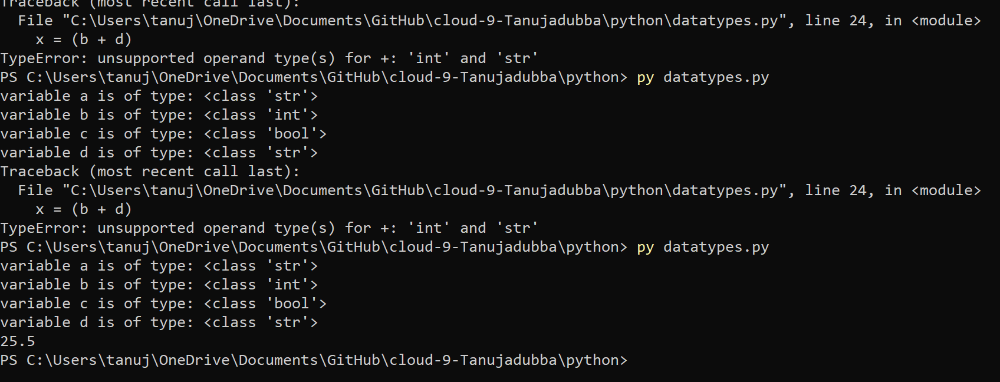
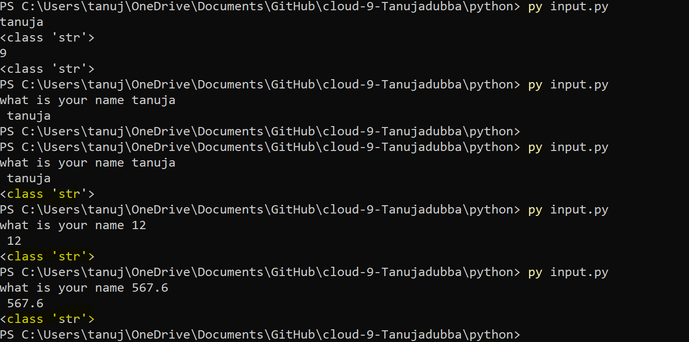

datatypespr3.md
# Introduction
- A data type is an attribute associated with a piece of data that tells a computer system how to interpret its value. Understanding data types ensures that data is collected in the preferred format and the value of each property is as expected.
# Integer (int)

- It is the most common numeric data type used to store numbers without a fractional component (-707, 0, 707).

# Floating Point (float)

- It is also a numeric data type used to store numbers that may have a fractional component like monetary values do (707.07, 0.7, 707.00).

Please note that number is often used as a data type that includes both int and float types.

# Character (char)

- It is used to store a single letter, digit, punctuation mark, symbol, or blank space.

# String (str or text)

- It is a sequence of characters and the most commonly used data type to store text. Additionally, a string can also include digits and symbols, however, it is always treated as text.

 - A phone number is usually stored as a string (+1-999-666-3333) but can also be stored as an integer (9996663333).

# Boolean (bool)
 
 - It represents the values true and false. When working with the boolean data type, it is helpful to keep in mind that sometimes a boolean value is also represented as 0 (for false) and 1 (for true).

# Source

(https://www.w3schools.com/python/python_datatypes.asp)

(https://stackoverflow.com/questions/66033684/how-to-add-two-string-numbers-with-floating-point)

(https://amplitude.com/blog/data-types)

(https://www.geeksforgeeks.org/taking-input-in-python/)

# Exercise1

- Determine the data types of all four variables (a, b, c, d) using a built in function.
-	Make a new variable x and give it the value b + d. Print the value of x. This will raise an error. Fix it so that print(x) prints a float.
-	Write a comment above every line of code that tells the reader what is going on in your script.

# Result

[]

[]

# Exercise2

-	Create a new script.
-	Use the input() function to get input from the user. Store that input in a variable.
-	Find out what data type the output of input() is. See if it is different for different kinds of input (numbers, words, etc.).

# Result

[]
