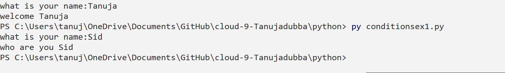
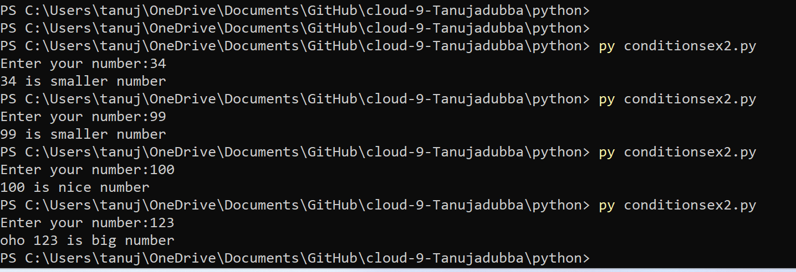

# Conditions

# Introduction

-  There comes a situation in programming where a specific task is to be performed if a specific condition is True. In such cases, conditional statements can be used. The following are the conditional statements provided by Python. 

- if
- else
- elif

# if

- If the simple code of block is to be performed if the condition holds true then if statement is used. Here the condition mentioned holds true then the code of block runs otherwise not.

# else

- if..else Statement
In conditional if Statement the additional block of code is merged as else statement which is performed when if condition is false. 

# elif

- The elif statement allows you to check multiple expressions for TRUE and execute a block of code as soon as one of the conditions evaluates to TRUE.

Similar to the else, the elif statement is optional. However, unlike else, for which there can be at most one statement, there can be an arbitrary number of elif statements following an if.

# Source

(https://www.tutorialspoint.com/python/python_if_else.htm)

(https://stackabuse.com/getting-user-input-in-python/)

(https://www.w3schools.com/python/python_conditions.asp)

(https://www.simplilearn.com/tutorials/python-tutorial/python-if-else-statement)

# Exercise 1:

- Create a new script.
- Use the input() function to ask the user of your script for their name. If the name they input is your name, print a personalized welcome message. If not, print a different personalized message.

# Result

# Exercise 2:

- Create a new script.
- Ask the user of your script for a number. Give them a response based on whether the number is higher than, lower than, or equal to 100.

# Result

