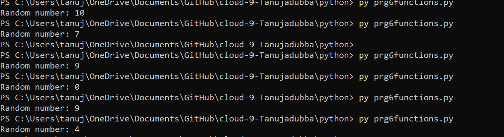
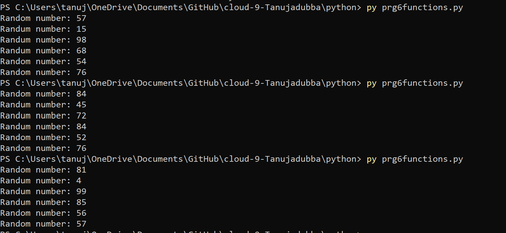
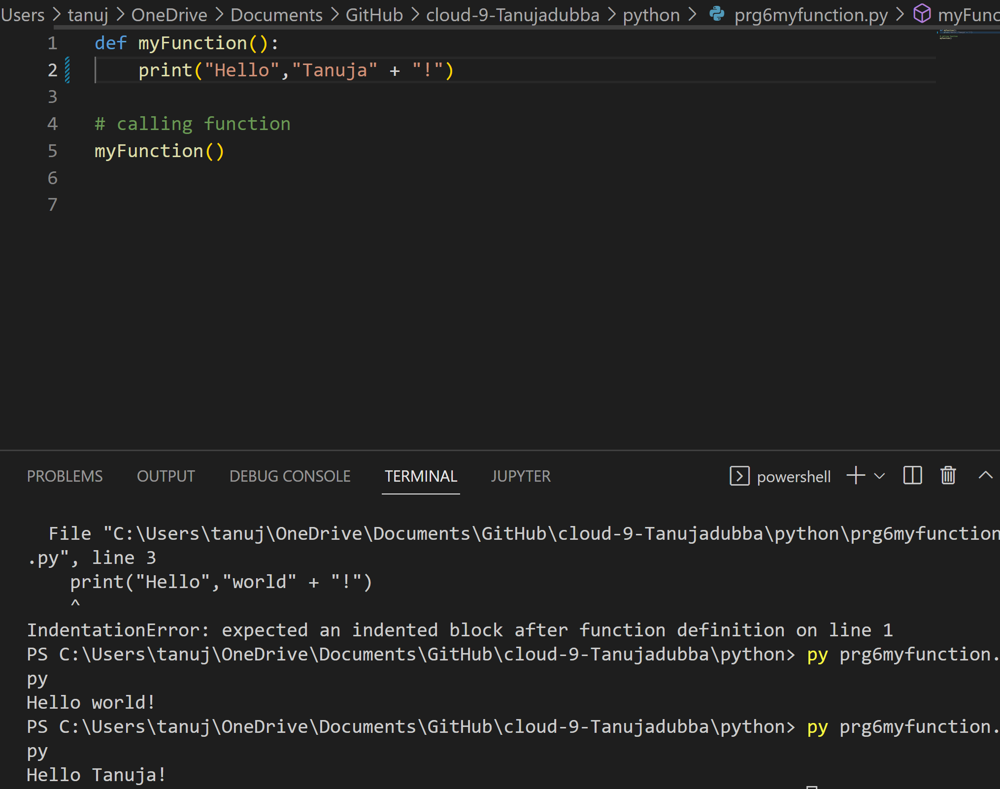
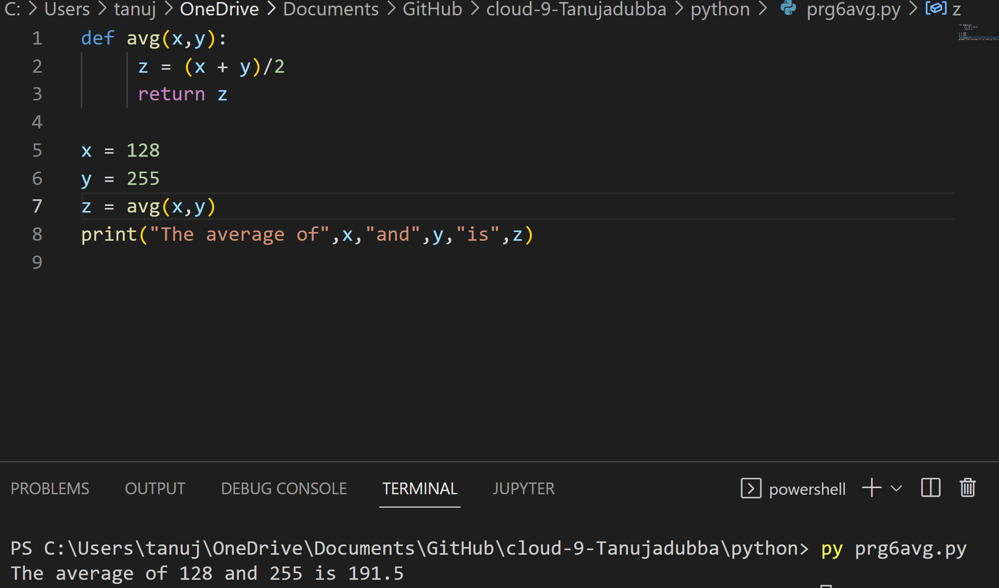

prg6functions.md
# Introduction

# Functions

- A function is a block of code which only runs when it is called.

- You can pass data, known as parameters, into a function.

- A function can return data as a result.

- To call a function, use the function name followed by parenthesis.

# Key terminology

  - Parameter
  - Argument

- From a function's perspective:

- A parameter is the variable listed inside the parentheses in the function definition.

- An argument is the value that is sent to the function when it is called.

# Exercise 1:

- Create a new script.
- Import the random package.
- Print 5 random integers with a value between 0 and 100.

# Result

# Exercise 2:

- Create a new script.
- Write a custom function myfunction() that prints “Hello, world!” to the terminal. Call myfunction.
-	Rewrite your function so that it takes a string as an argument. Then, it should print “Hello, <string>!”.

# Result

# Exercise 3:

- Write the custom function avg() so that it returns the average of the given parameters.

# Source

(https://www.w3schools.com/python/python_functions.asp)

(https://stackoverflow.com/questions/52578602/how-does-a-python-recursive-function-works-for-tri-recursion-function)

(https://pythontutor.com/visualize.html#mode=edit)

(https://www.simplilearn.com/tutorials/python-tutorial/find-average-of-list-in-python)

(https://www.toppr.com/guides/python-guide/tutorials/modules/modules/random/use-random-module-to-generate-random-numbers-in-python/#:~:text=The%20Python%20import%20random%20module%20in%20Python%20defines%20a%20series,functions%20in%20the%20random%20module.)

(https://www.pythonforbeginners.com/random/how-to-use-the-random-module-in-python)
