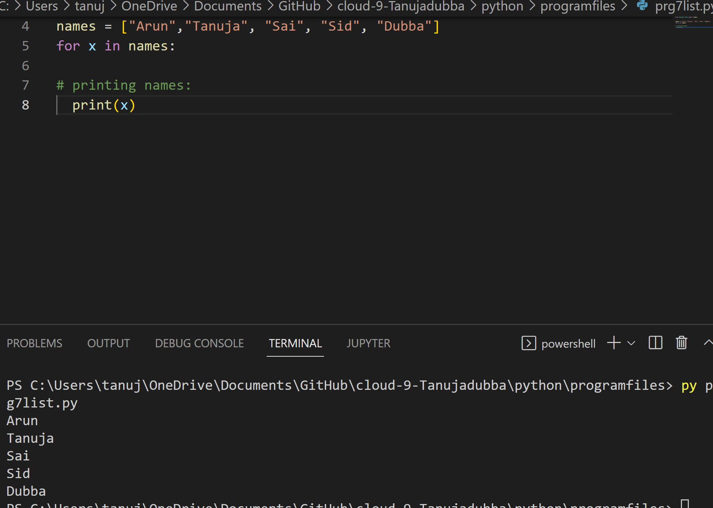
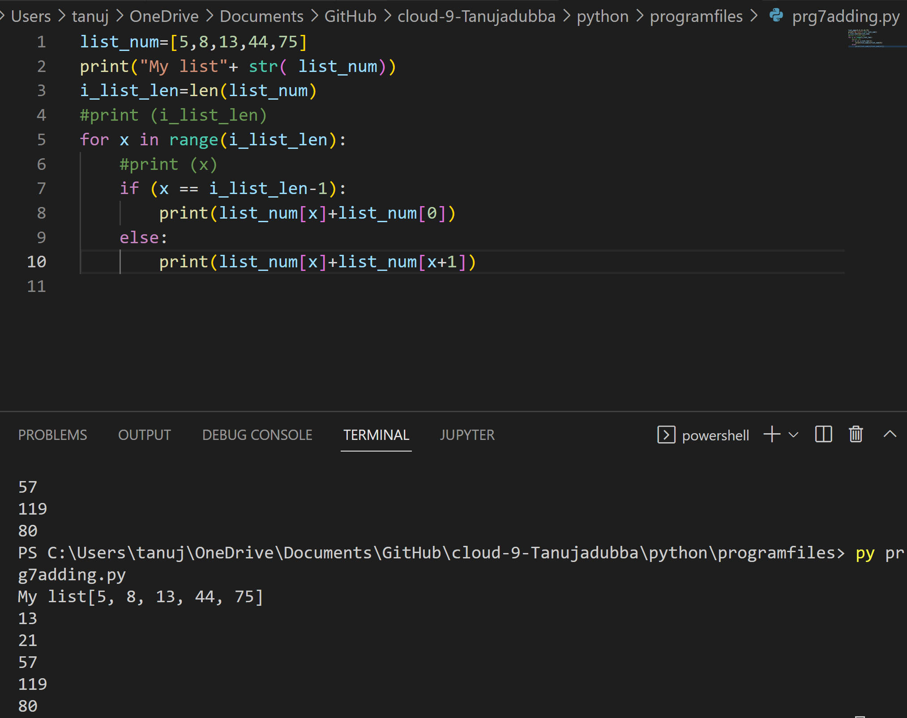

# Lists
- Lists are used to store multiple items in a single variable.

- Lists are one of 4 built-in data types in Python used to store collections of data, the other 3 are Tuple, Set, and Dictionary, all with different qualities and usage.

- Lists are created using square brackets

- A list can contain different data types.

 **List Items**

- List items are ordered, changeable, and allow duplicate values.

- List items are indexed, the first item has index [0], the second item has index [1] etc.

 **Ordered**
- When we say that lists are ordered, it means that the items have a defined order, and that order will not change.

- If you add new items to a list, the new items will be placed at the end of the list.

**Changeable**

- The list is changeable, meaning that we can change, add, and remove items in a list after it has been created.

**Allow Duplicates**

- Since lists are indexed, lists can have items with the same value.

**The list() Constructor**

- It is also possible to use the list() constructor when creating a new list.

# Source

(https://www.w3schools.com/python/python_lists.asp)

(https://www.programiz.com/python-programming/examples/add-number)

(https://www.w3schools.com/python/python_howto_add_two_numbers.asp)

# Exercise 1:

- Create a new script.
- Create a variable that contains a list of five names.
- Loop over the list using a for loop. Print every individual name in the list on a new line.

# Result

# Exrcise 2:

- Create a new script.
- Create a list of five integers.
- Use a for loop to do the following for every item in the list:
Print the value of that item added to the value of the next item in the list. If it is the last item, add it to the value of the first item instead (since there is no next item).

# Result

