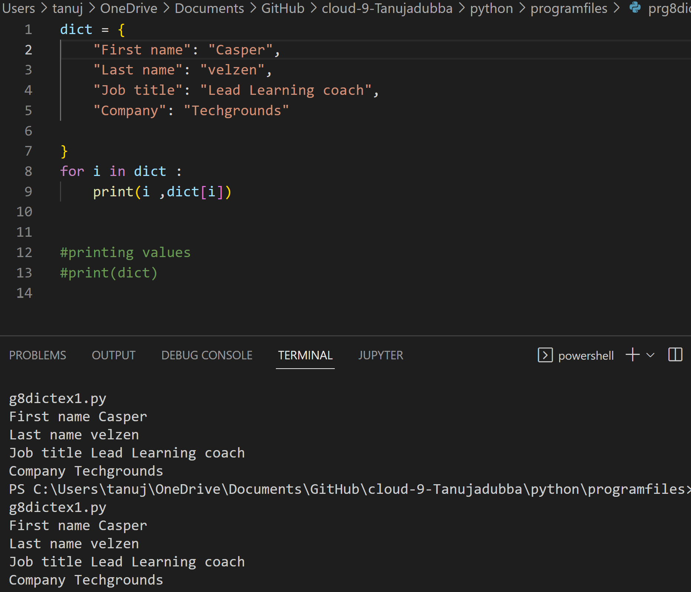
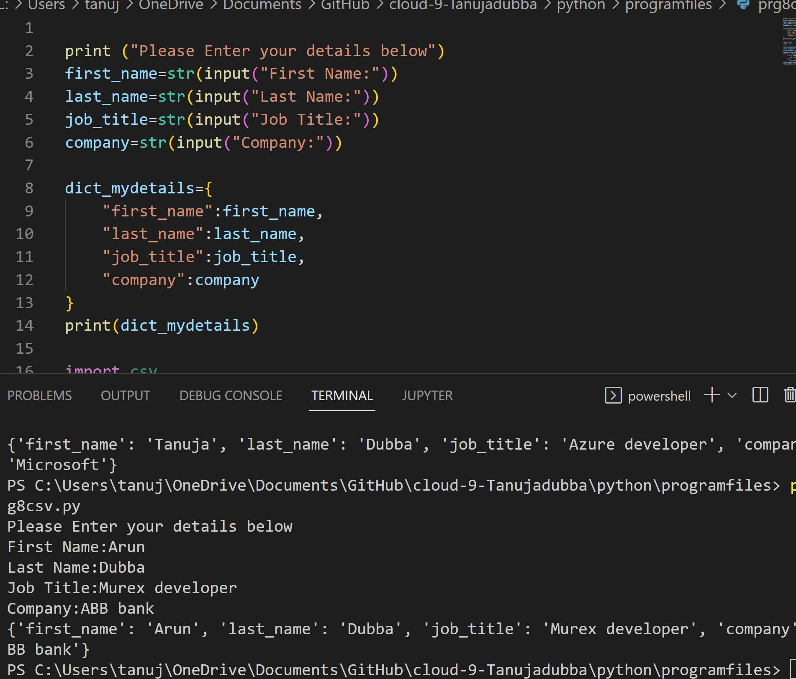
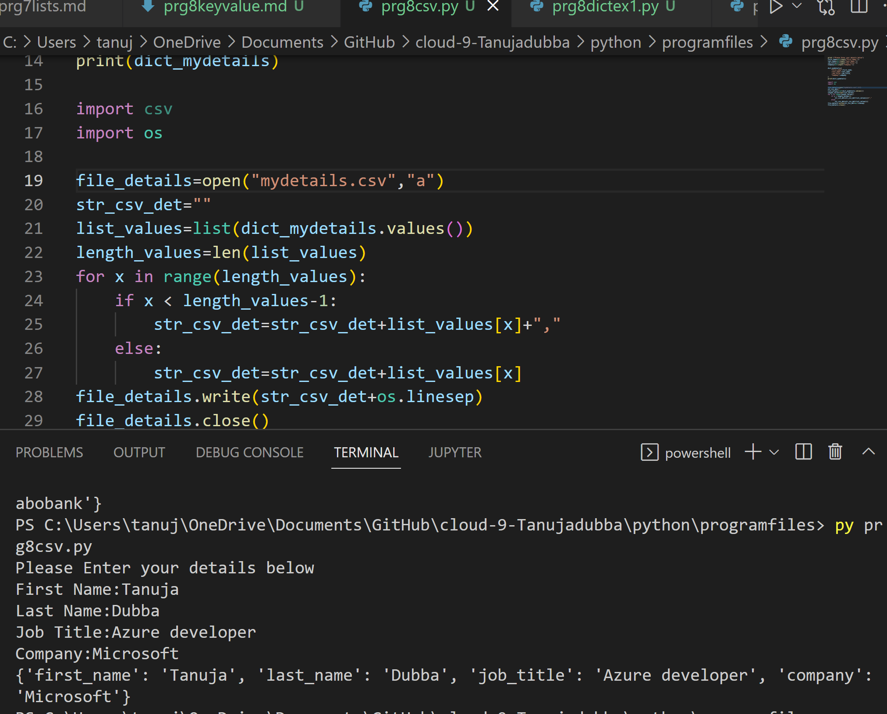
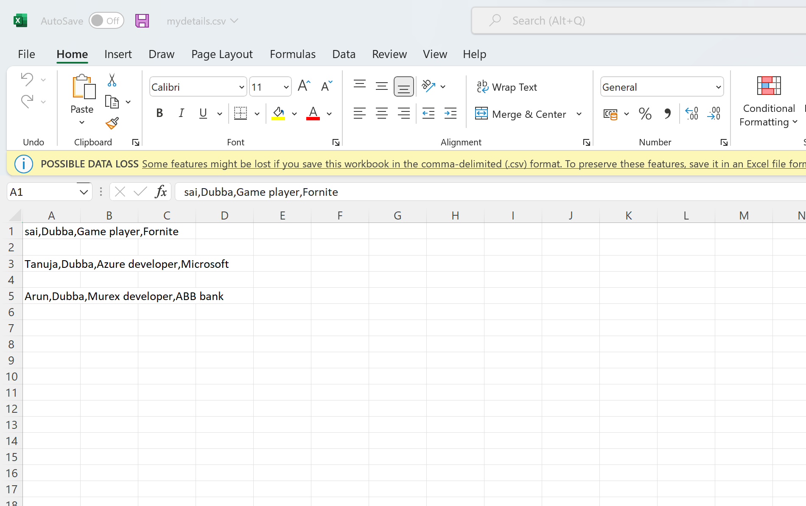
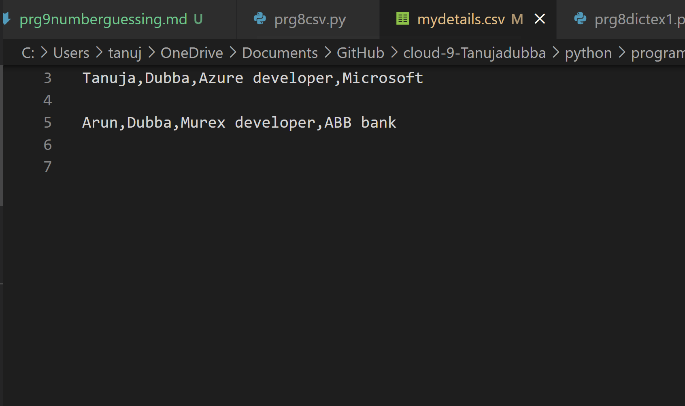

# Keyvalue pairs

- An item has a key and a corresponding value that is expressed as a pair (key: value). While the values can be of any data type and can repeat, keys must be of immutable type (string, number or tuple with immutable elements) and must be unique.

# Expalanation:

**Dictionary**

- Dictionaries are used to store data values in key:value pairs.

- A dictionary is a collection which is ordered*, changeable and do not allow duplicates.

- Dictionaries are written with curly brackets, and have keys and values.

**Dictionary Items**

- Dictionary items are ordered, changeable, and does not allow duplicates.

- Dictionary items are presented in key:value pairs, and can be referred to by using the key name.

**Ordered or Unordered?**

- As of Python version 3.7, dictionaries are ordered. In Python 3.6 and earlier, dictionaries are unordered.

- When we say that dictionaries are ordered, it means that the items have a defined order, and that order will not change.

- Unordered means that the items does not have a defined order, you cannot refer to an item by using an index.

**Dictionary Length**

- To determine how many items a dictionary has, use the len() function.

**Changeable**

- Dictionaries are changeable, meaning that we can change, add or remove items after the dictionary has been created.

**Duplicates Not Allowed**

- Dictionaries cannot have two items with the same key.

**Dictionary Items - Data Types**

- The values in dictionary items can be of any data type.

# Exercise 1:

  -	Create a new script.
  - Create a dictionary with the following keys and values
  -  Loop over the dictionary and print every key-value pair in the terminal.

# Exercise 2:

-	Create a new script.
-	Use user input to ask for their information (first name, last name, job title, company). Store the information in a dictionary.
-	Write the information to a csv file (comma-separated values). The data should not be overwritten when you run the script multiple times.

# Result

# Source

(https://www.w3schools.com/python/python_dictionaries.asp)

(https://www.w3schools.com/python/python_dictionaries_loop.asp)

(https://www.geeksforgeeks.org/python-accessing-key-value-in-dictionary/)

(https://www.geeksforgeeks.org/how-to-save-a-python-dictionary-to-a-csv-file/)

(https://www.programiz.com/python-programming/methods/dictionary/get)
