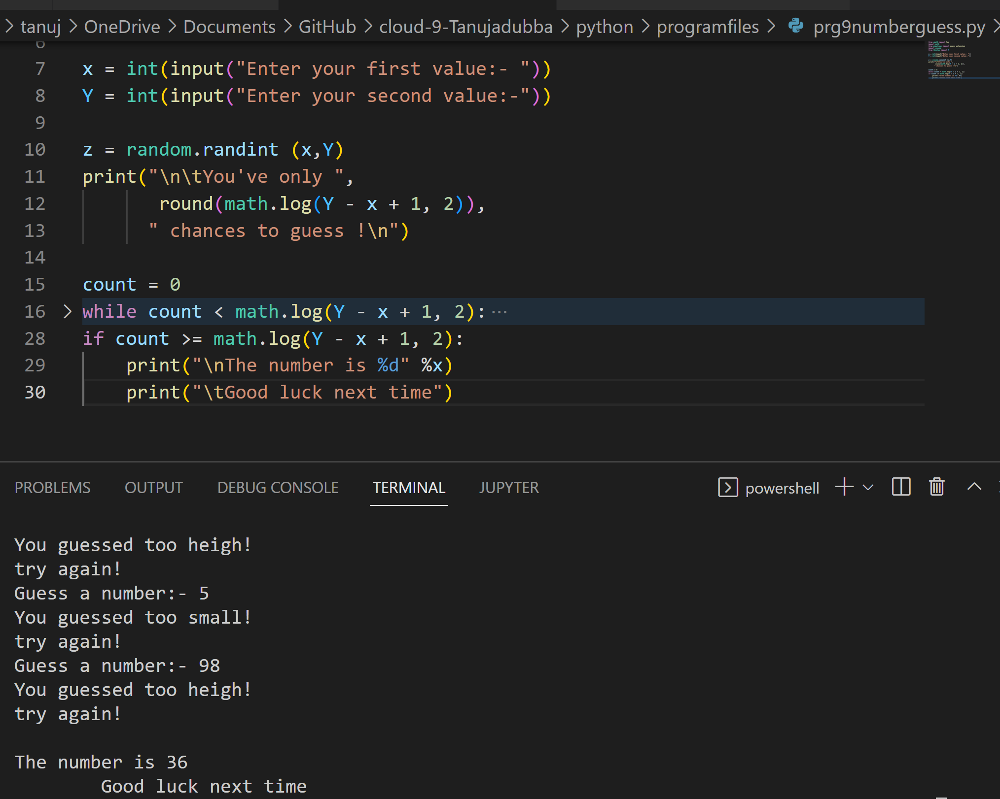
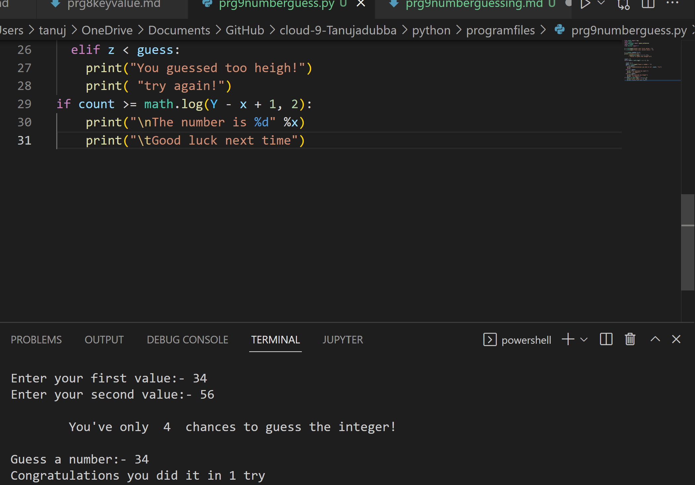

# Number guessing Game

# Result:

# steps:

- User inputs x and y of the range.
- The compiler generates a random integer between the range and store it in a variable for future references.
- For repetitive guessing, a while loop will be initialized.
- If the user guessed a number which is greater than a randomly selected number, the user gets an output “Try Again! You guessed too high“
- Else If the user guessed a number which is smaller than a randomly selected number, the user gets an output “Try Again! You guessed too small”
- And if the user guessed in a minimum number of guesses, the user gets a “Congratulations! ” Output.
- Else if the user didn’t guess the integer in the minimum number of guesses, he/she will get “Good Luck Next Time!” output.

