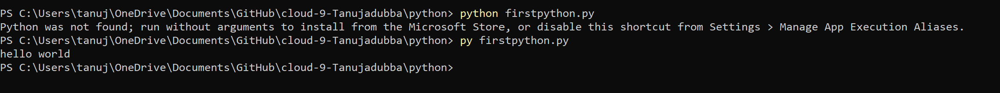

settingup.md
# Introdutction
- Python is a high-level, general-purpose programming language. Its      design philosophy emphasizes code readability with the use of significant indentation.

- Python is dynamically-typed and garbage-collected. It supports multiple programming paradigms, including structured (particularly procedural), object-oriented and functional programming.

# IDE
- An integrated development environment (IDE) is a software application that provides comprehensive facilities to computer programmers for software development. An IDE normally consists of a source code editor, build automation tools, and a debugger. Most modern IDEs have intelligent code completion.

# Overcomechallenge
None.

# Exercise
- Install the latest version of Python from https://www.python.org/
  - Installed using the website.

- Install VS Code from https://code.visualstudio.com/download
   
  - Installed already for previous assingments.

- Install the Python plug-in in VS Code.

 - Installed in visuall studio.

-	Write the following Python code. The output in the terminal should be the text “Hello world!”

[ "firstpython.py"]

[]

# Source

(https://www.programiz.com/python-programming/examples/hello-world#:~:text=print('Hello%2C%20world!')&text=Output-,Hello%2C%20world!,on%20our%20screen.)

(https://code.visualstudio.com/docs/python/python-tutorial)

(https://www.youtube.com/watch?v=vBrrOa_SJog)

