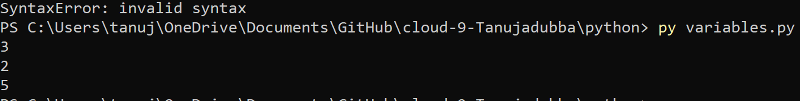
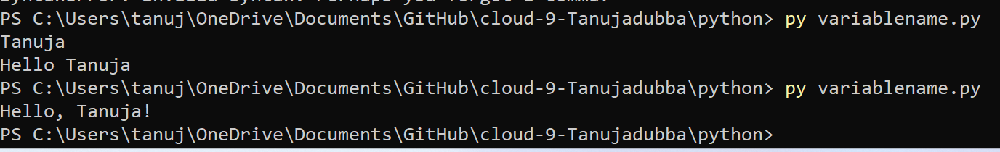
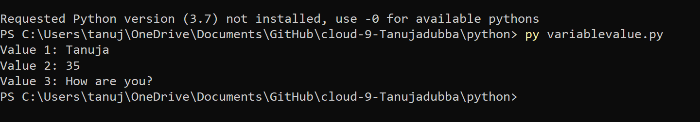

variables.md

# Introduction
- A variable is a symbolic name for (or reference to) information. The     variable's name represents what information the variable contains. They are called variables because the represented information can change but the operations on the variable remain the same.

- A variable name must begin with a letter of the alphabet or an underscore(_) Example: abc=100 #valid syntax.

- The first character can be followed by letters, numbers or underscores.

- Python variable names are case sensitive.

- Reserved words cannot be used as variable names.

**Top 4 Types of Variables in Python**

1. Integer: Numeric values.

2. Long Integer: A integer whose length is greater than a usual integer type variable.

3. Float: Variables that are intended to hold floating precession values.

4. String: Variables that are intended to hold a string of letters.

# Source

(https://www.w3schools.com/python/python_variables.asp)

(https://www.educba.com/python-variables/)

(https://www.youtube.com/watch?v=V11VaNZejvA)

# Exercise 1:

- Create a new script.
  > variables.py
- Create two variables x and y. Assign a numerical value to both variables.- Print the values of x and y.
x = 3
y = 2
print (x)
print (y)
- Create a third variable named z. The value of z should be the sum of x and y.
- Print the value of z.
z = ( x+y )
print (z)

[ "variablesex1.png"]

# Exercise 2:

- Create a new script.
 
 > variablename.py

- Create a variable name. The value of name should be your name.
name= "Tanuja"
print("Hello, " + name + "!")

- Print the text “Hello, <your name here>!”. Use name in the print statement.

[]

# Exercise 3:

-  Create a new script.
 > variablevalue.py
-  Create a variable and assign a value to it.
-  Print the text “Value 1: <value 1 here>”.
-  Change the value of that same variable.
-  Print the text “Value 2: <value 2 here>”.
-  Change the value of that same variable.
-  Print the text “Value 3: <value 3 here>”.

[]

